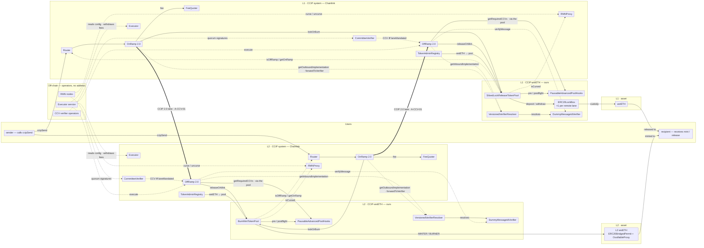
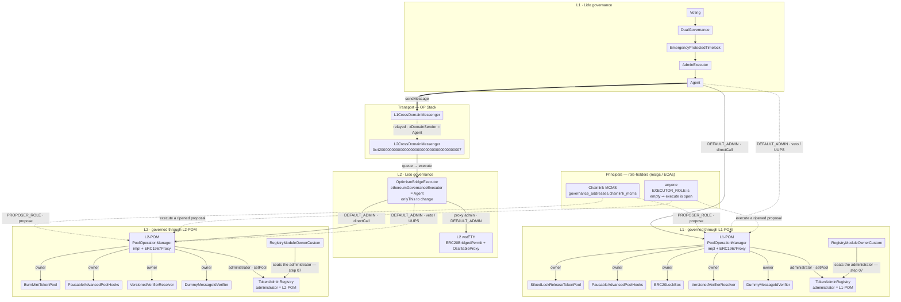
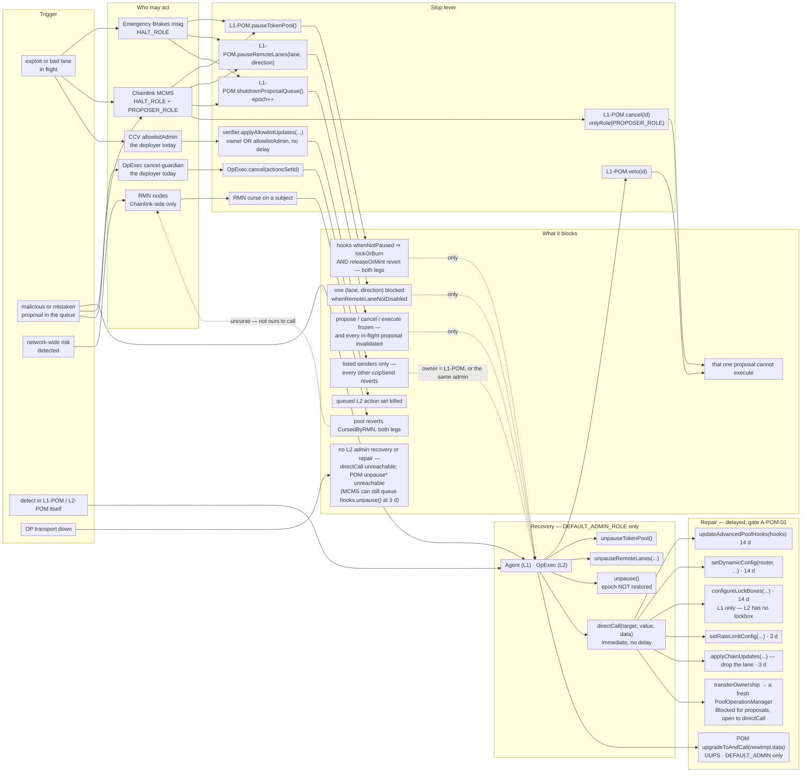
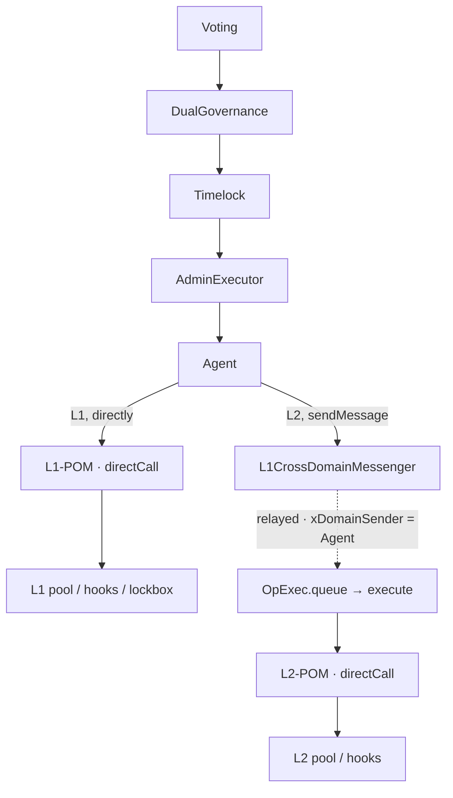
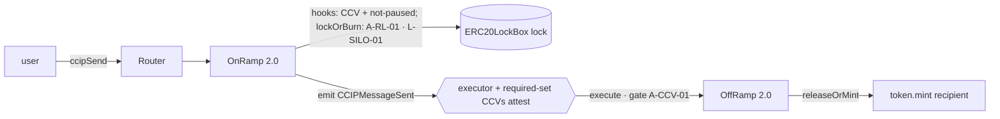

# Architecture — wsteth-2.0 (final / end state)

> **September 15 deployment:** use [Current deployment and POM permissions](CURRENT-DEPLOYMENT.md)
> and the [deployment report](deployment-2026-09-15.md). The detailed POM descriptions below
> are historical: proposal modes, guardian/veto/approval APIs and combined pause roles no longer apply.

This document describes the **end-state topology** of `wsteth-2.0`: every contract, every key actor,
and the relationships that bind them after the full pipeline (`just all`) has run.

Two things are described here and `C.30` requires they not be fused (`CC-C30-1`, `CC-C30-4`):

- **the subject** — the systems that *exist*: the anvil-fork deployment and the live testnet
  deployment enumerated in [`README.md` §1.1](../README.md#11-substrates--the-canonical-status-claim);
- **the expected content of the architecture claim** — the **production topology** the same structure
  is intended to carry: Lido governance on **Ethereum mainnet (L1)** bridging wstETH to an **OP-stack
  L2** via CCIP 2.0. **Nothing is deployed on mainnet.** The mainnet chain-id in the
  diagrams below labels that intended target, not an observed deployment.

Where the two diverge on a deployment that exists — a 1-of-1 declared CCV set instead of a quorum
(§5.3), governance principals that are distinct keys but single EOAs rather than multisigs, and Dual
Governance committees on `ACTORS_MNEMONIC` EOAs, not public anvil keys (`PERMISSIONS.md` §4.3) — the divergence is
stated at the point it occurs, not smoothed over.

## 0. What this document is — `C.30` (Architecture Description Adequacy)

Read this header before the diagrams, so the rest is read with the right force.

Per FPF **`C.30`**, this file is an **`ArchitectureDescription@Context`** — a *description* (D/S
episteme) of the architecture claim, governed by `C.30`. It is **not**:

- **not the architecture itself** (`CC-C30-2/3`): the architecture is the *selected structure* over
  the deployed holon; this document only describes it. The deployed contracts are the holon.
- **not evidence and not an assurance verdict** (`CC-C30-9`): "the topology is correct" and "the
  bridge carries a transfer" are the two scoped **`B.3`** assurance claims (Claim A / Claim B) and
  live in [`README.md`](../README.md) §3–§5. This document does not re-assert them; it gives the
  *structure those claims are about*.
- **not a decision record** (`CC-C30-9`): design choices (L2 token shape, full OnRamp+OffRamp on the
  fork) were set-valued comparisons; each kept as named criteria with no single collapsed score.

| Field | Value |
|---|---|
| `describedHolonRef` | the `wsteth-2.0` deployments that **exist**: Lido core + DG on L1 with wstETH bridged via CCIP-2.0 pools to an L2, on the anvil forks and on the live testnet pair — [`README.md` §1.1](../README.md#11-substrates--the-canonical-status-claim) is the canonical list |
| `boundedContextRef` | the substrates in that list: Sepolia (L1) ↔ Mantle Sepolia (L2), as forks or as a live testnet |
| *expected content of the architecture claim* (**not** the subject — `CC-C30-1`) | the **live-network target**: Ethereum mainnet (L1, chainid 1) + an OP-stack L2. The diagrams are drawn against this target; it has **no deployment**. Every quantitative statement below is read from a substrate that exists, and says which. |
| `activeStructureKindRefs` | Role/Enactor (Work) · Control · Flow/Transduction · Information/Custody · SecurityTrustBoundary · PlacementDeployment. **`FunctionalStructure` is deliberately not here** — the functional view (required effects, bearers, gaps) is [`FUNCTION.md`](./FUNCTION.md). |
| `admissibleUse` | understand which contract does what, who may call it, how value and authority move, what the end-state ownership matrix is |
| `nonAdmissibleUse` | as proof the live system works (the forks run **CCIP 1.5**, not 2.0 — §6); as a safety/assurance verdict; as a substitute for `state/*.json` / `config/chains/*.json` as the address source of truth |

**`ArchitectureDescriptionFreshnessCue`.** This description is pinned to the last fork deploy;
the per-contract addresses live in `state/*.json` / `config/chains/*.json` (the source of truth, not
this file — `CC-C30-3`). Trigger to refresh: any tray restart / re-run of
`script/01..05`. Ephemeral harness contracts (§6) are re-deployed every `just test-scenarios` and
have no stable address.

---

## 1. Topology at a glance (PlacementDeployment view — `structureKind = PlacementDeploymentStructure`)

Contracts are grouped by **standing authority over the deployed instance** — who may change it — not by
which pipeline step deploys it, since on a fork step 01 also deploys the "pre-existing" Lido core
(`A.7`: the Object is not the Work that produced it). Authorship cuts across the grouping and is not the
criterion: four contracts under "CCIP-wstETH — ours" are Chainlink-authored (both pools, the lockbox, the
resolver), and `OptimismBridgeExecutor` under "Lido core" is Aave-authored. **"Ours" means `L1-POM` / `L2-POM` owns it.** Deploying step and address record: [§1.5](#15-contract-inventory); what each CCIP box does: [§1.4](#14-what-each-ccip-box-does-on-the-lane).
Three scope-restricted cuts of the same structure follow the diagram: [§1.1](#11-bridging-subsystem--who-participates),
[§1.2](#12-regular-governance--who-participates) and [§1.3](#13-emergency-reaction-and-recovery--who-can-stop-it-and-who-can-start-it-again).

```
                   L1 · Ethereum mainnet (1)         L2 · OP-stack L2
 ═════════════════════════════════════════════════════════════════════════════════════
 LIDO CORE         wstETH  ◀ the bridged asset       L2 wstETH = ERC20BridgedPermit
 the asset and     stETH · LidoLocator                 behind OssifiableProxy
 the DAO's spine   ResealManager                       proxy admin = OpExec
                   Voting ▸ DualGovernance ▸         OptimismBridgeExecutor  OpExec
                   Timelock ▸ AdminExecutor ▸          ethereumGovernanceExecutor
                   Agent                               = L1 Agent (onlyThis to change)
                     │ DEFAULT_ADMIN_ROLE              │ DEFAULT_ADMIN_ROLE
                     ▼                                 ▼
 ─────────────────────────────────────────────────────────────────────────────────────
 CCIP-wstETH       PoolOperationManager L1-POM       PoolOperationManager L2-POM
 ours · owned by     impl + ERC1967Proxy               impl + ERC1967Proxy
 L1-POM / L2-POM   SiloedLockReleaseTokenPool        BurnMintTokenPool
                   PausableAdvancedPoolHooks         PausableAdvancedPoolHooks
                   ERC20LockBox ×1 per lane          no lockbox — no L2 custody
                   VersionedVerifierResolver         VersionedVerifierResolver
                     ▸ DummyMessageIdVerifier          ▸ DummyMessageIdVerifier
 ─────────────────────────────────────────────────────────────────────────────────────
 PRINCIPALS        Emergency Brakes msig  HALT_ROLE on both POMs
 both POMs' roles  Chainlink MCMS         PROPOSER_ROLE + HALT_ROLE
 msigs / EOAs —    POM governance controls are DEFAULT_ADMIN-only; Emergency shutdown voids queue
 one entry each    POM unpause* is DEFAULT_ADMIN only; hooks unpause via queue (3 d) — global
                                          on a spoke, per-lane on both; EXECUTOR_ROLE empty ⇒ execute open
 per chain record  mcms · multisig (brakes + guardian) · deployer — three keys (L-SEP-01)
 ─────────────────────────────────────────────────────────────────────────────────────
 CCIP SYSTEM       Router · TokenAdminRegistry · RegistryModuleOwnerCustom
 Chainlink deploys RMNProxy · FeeQuoter · OnRamp 2.0 · OffRamp 2.0
 and owns them,    Executor · CommitteeVerifier   ◀ neither pinned nor probed
 except one seat   the same set on each chain; the addresses are external L facts.
                   We DO hold the TAR per-token administrator —
                   that seat is L1-POM / L2-POM; §1.2 draws it
 ─────────────────────────────────────────────────────────────────────────────────────
 OP STACK          L1CrossDomainMessenger            L2CrossDomainMessenger
 governance leg      ──────── sendMessage ─────────▶  relayed · xDomainSender = Agent
 only
 ═════════════════════════════════════════════════════════════════════════════════════
 token flow        L1→L2  lock ▸ mint            L2→L1  burn ▸ lockbox release
 gates → §5.3      A-CCV-01 OffRamp · A-RL-01 pool · L-SILO-01 lockbox
                   A-POM-01 L1-POM / L2-POM
```

*Rendered view — **one lane, every contract on it its own box**, with the relations §3–§5 unfold. A box is
one deployed address: where an implementation sits behind a proxy, both names ride in the same box.
`L1 · Lido core` carries only the two the bridge touches, `Agent` and `wstETH`: the governance chain above
`Agent` (`Voting → DualGovernance → EmergencyProtectedTimelock → AdminExecutor`, with `ResealManager` off it)
is drawn in full in [§4](#4-governance-command-path--control-view-structurekind--controlstructure), and
`stETH` / `LidoLocator` sit off the bridge path. All seven stay in the text diagram above and in §1.5.*

```mermaid
%%{init: {"flowchart": {"nodeSpacing": 22, "rankSpacing": 38, "padding": 6, "subGraphTitleMargin": {"top": 2, "bottom": 6}}}}%%
flowchart LR
  subgraph L1C["L1 · Lido core"]
    direction TB
    AGT[Agent]
    WS1[wstETH]
  end
  subgraph L1W["L1 · CCIP-wstETH — ours"]
    direction TB
    POM1["L1-POM<br/>PoolOperationManager<br/>impl + ERC1967Proxy"]
    POM1 -->|owner| PL1[SiloedLockReleaseTokenPool]
    POM1 -->|owner| HK1[PausableAdvancedPoolHooks]
    POM1 -->|owner| LBX["ERC20LockBox<br/>×1 per remote lane"]
    POM1 -->|owner| RSV1[VersionedVerifierResolver]
    POM1 -->|owner| VER1[DummyMessageIdVerifier]
    RSV1 -->|resolves| VER1
  end
  subgraph L1S["L1 · CCIP system — Chainlink"]
    direction TB
    RTR1[Router] --> ONR1["OnRamp 2.0"]
    ONR1 -->|fee| FQR1[FeeQuoter]
    RMO1[RegistryModuleOwnerCustom] -->|"seats admin"| TAR1[TokenAdminRegistry]
    OFR1["OffRamp 2.0"]
    EXC1[Executor]
    CMV1[CommitteeVerifier] -.->|"CCV iff laneMandated"| OFR1
    RMN1[RMNProxy]
  end
  subgraph L1X["L1 · OP Stack"]
    XDM1[L1CrossDomainMessenger]
  end

  subgraph L2C["L2 · Lido core"]
    direction TB
    OPX["OptimismBridgeExecutor<br/>ethereumGovernanceExecutor = Agent<br/>onlyThis to change"]
    WS2["L2 wstETH<br/>ERC20BridgedPermit + OssifiableProxy"]
    OPX -->|"proxy admin · DEFAULT_ADMIN"| WS2
  end
  subgraph L2W["L2 · CCIP-wstETH — ours"]
    direction TB
    POM2["L2-POM<br/>PoolOperationManager<br/>impl + ERC1967Proxy"]
    POM2 -->|owner| PL2[BurnMintTokenPool]
    POM2 -->|owner| HK2[PausableAdvancedPoolHooks]
    POM2 -->|owner| RSV2[VersionedVerifierResolver]
    POM2 -->|owner| VER2[DummyMessageIdVerifier]
    RSV2 -->|resolves| VER2
  end
  subgraph L2S["L2 · CCIP system — Chainlink"]
    direction TB
    RTR2[Router] --> ONR2["OnRamp 2.0"]
    ONR2 -->|fee| FQR2[FeeQuoter]
    RMO2[RegistryModuleOwnerCustom] -->|"seats admin"| TAR2[TokenAdminRegistry]
    OFR2["OffRamp 2.0"]
    EXC2[Executor]
    CMV2[CommitteeVerifier] -.->|"CCV iff laneMandated"| OFR2
    RMN2[RMNProxy]
  end
  subgraph L2X["L2 · OP Stack"]
    XDM2["L2CrossDomainMessenger<br/>0x4200000000000000000000000000000000000007"]
  end

  subgraph PRIN["Governance principals — roles on both POMs"]
    direction TB
    EBRK["Emergency Brakes msig<br/>governance_addresses.emergency_brakes"]
    MCMS["Chainlink MCMS<br/>governance_addresses.chainlink_mcms"]
  end

  subgraph OFF["Off-chain — operators, no address"]
    direction TB
    CCVOP["CCV verifier operators<br/>sign / attest → verifierResults"]
    EXSVC["Executor service<br/>calls OffRamp.execute"]
    RMNOP["RMN nodes<br/>curse / uncurse a subject"]
  end

  AGT -->|DEFAULT_ADMIN| POM1
  OPX -->|DEFAULT_ADMIN| POM2
  AGT ==>|sendMessage| XDM1
  XDM1 -.->|"relayed · xDomainSender = Agent"| XDM2
  XDM2 -->|"queue → execute"| OPX

  TAR1 -->|"wstETH → pool"| PL1
  TAR2 -->|"wstETH → pool"| PL2
  ONR1 -->|lockOrBurn| PL1
  ONR2 -->|lockOrBurn| PL2
  OFR1 -->|releaseOrMint| PL1
  OFR2 -->|releaseOrMint| PL2
  OFR1 -->|"getRequiredCCVs · via the pool"| HK1
  OFR2 -->|"getRequiredCCVs · via the pool"| HK2
  OFR1 -.->|getInboundImplementation| RSV1
  OFR1 -.->|verifyMessage| VER1
  ONR1 -.->|"getOutboundImplementation · forwardToVerifier"| RSV1
  OFR2 -.->|getInboundImplementation| RSV2
  OFR2 -.->|verifyMessage| VER2
  ONR2 -.->|"getOutboundImplementation · forwardToVerifier"| RSV2
  PL1 -->|"pre / postflight"| HK1
  PL2 -->|"pre / postflight"| HK2
  PL1 -.->|isCursed| RMN1
  PL2 -.->|isCursed| RMN2
  PL1 -.->|"isOffRamp / getOnRamp"| RTR1
  PL2 -.->|"isOffRamp / getOnRamp"| RTR2
  PL1 -->|"deposit / withdraw"| LBX
  LBX -->|custody| WS1
  PL2 -->|"MINTER / BURNER"| WS2

  ONR1 ==>|"CCIP 2.0 lane · A-CCV-01"| OFR2
  ONR2 ==>|"CCIP 2.0 lane · A-CCV-01"| OFR1

  EBRK -.->|HALT_ROLE| POM1
  EBRK -.->|HALT_ROLE| POM2
  MCMS -.->|"PROPOSER_ROLE · HALT_ROLE"| POM1
  MCMS -.->|"PROPOSER_ROLE · HALT_ROLE"| POM2

  CCVOP -.->|"quorum signatures"| CMV1
  CCVOP -.->|"quorum signatures"| CMV2
  EXSVC -.->|execute| OFR1
  EXSVC -.->|execute| OFR2
  EXSVC -.->|"reads config · withdraws fees"| EXC1
  EXSVC -.->|"reads config · withdraws fees"| EXC2
  RMNOP -.->|"curse / uncurse"| RMN1
  RMNOP -.->|"curse / uncurse"| RMN2
```



### 1.1 Bridging subsystem — who participates

The same structure, **restricted to the elements a token transfer touches**. Governance, the `L1-POM` / `L2-POM` stack
and the OP messengers drop out entirely: none of them is on the transfer path. This answers *what is in
scope when we say "bridging"*; the **order** the calls happen in is the Flow view, [§5.1](#51-flowtransduction-view-structurekind--flowtransductionstructure).



> **What the pause principals do here.** They are not drawn: pausing is an incident lever ([§1.3](#13-emergency-reaction-and-recovery--who-can-stop-it-and-who-can-start-it-again)).
> Its *effect* lands on this subsystem through `PausableAdvancedPoolHooks`, which refuses every pool
> operation while paused — so the brakes reach the transfer path through the hooks box, not around it.

### 1.2 Regular governance — who participates

The same structure restricted to the elements a **planned authority change** touches: proposing,
delaying, approving, executing, and the setters those land on. The ramps, the lockbox custody edge and
the asset drop out. Incident levers — pause, veto, cancel, curse — are **not** here; they are
[§1.3](#13-emergency-reaction-and-recovery--who-can-stop-it-and-who-can-start-it-again). The **order** a
proposal traverses is the Control view, [§4](#4-governance-command-path--control-view-structurekind--controlstructure).



> **Two things this view deliberately omits.** The guardian's `veto` and MCMS's `cancel` are stop
> levers, not regular governance — [§1.3](#13-emergency-reaction-and-recovery--who-can-stop-it-and-who-can-start-it-again)
> draws them, together with the brakes multisig and the OpExec cancel-guardian, neither of which has a
> role on this path. The principals shown are distinct addresses on the current record, but single
> EOAs rather than the multisigs the boxes name (`L-SEP-01`, §1.4).

### 1.3 Emergency reaction and recovery — who can stop it, and who can start it again

The same structure restricted to the **incident path**: what goes wrong, who may halt it, what the halt
actually blocks, and — the half that is usually left undrawn — **what it takes to get back**. Every
`pause*` on `L1-POM` / `L2-POM` is `HALT_ROLE`-or-admin; every `unpause*` is `RESUME_ROLE`-or-admin, and
`RESUME_ROLE` is **unassigned by design**, so recovery *through the POM's own entry points* is
`DEFAULT_ADMIN_ROLE` only. The hooks' `unpause*` are `onlyOwner` with the POM as owner, so an executed
proposal reaches them too: `unpauseRemoteLanes` at 3 d on both chains, and `unpause` at 3 d on a
**non-L1 spoke**, where `0x3f4ba83a` carries no `Blocked` mode ([`PAUSES.md`](./PAUSES.md),
[`config/README.md`](../config/README.md) § *The hub/spoke row*). `L1-POM` is drawn; `L2-POM` differs
in who holds admin **and** in that one selector.



**What this view is for saying out loud.** Each of these is read off the deployed code, and each one
changes how an incident actually plays out:

| Fact | Consequence in an incident |
|---|---|
| `RESUME_ROLE` has **no holder** ([`PARAMETERS.md`](./PARAMETERS.md) `P-POM-07`) | a pauser **cannot undo its own pause**. Every recovery — token pool, lane, `L1-POM` / `L2-POM` queue — waits on `Agent` (L1) or an `OpExec` action set (L2). A mistaken brake is a governance round-trip to lift |
| `shutdownProposalQueue()` on `L1-POM` / `L2-POM` runs `epoch++` and `restartProposalQueue()` does not restore it | pausing it **destroys every in-flight proposal**, including benign ones. They must be re-proposed and re-serve their delay after recovery |
| `cancel(id)` is `onlyRole(PROPOSER_ROLE)`, not `onlyRoleOrAdmin` | the DAO holds no `PROPOSER_ROLE`, so it **cannot cancel directly** — its instrument is the admin-only `veto(id)`. It is not locked out, though: `DEFAULT_ADMIN_ROLE` is role-admin of every role and can `grantRole(PROPOSER_ROLE, self)` — with no delay — first |
| `cancel` is also `whenNotPaused` | once `L1-POM` / `L2-POM` is paused, `cancel` is unavailable — though the epoch bump has already voided the queue |
| the **hooks** allowlist enable flag is `immutable` and was deployed **disabled** ([`PARAMETERS.md`](./PARAMETERS.md) `P-ALW-01`) | that one is **not** a lever: turning it on means new hooks and a 14-day `updateAdvancedPoolHooks` |
| the **CCV** allowlist is a second, different allowlist and it is **mutable** — `applyAllowlistUpdates` is `owner() \|\| allowlistAdmin` and `allowlistAdmin` defaults to the **deployer**, never rotated | this *is* a no-delay origination stop, held today by a plain EOA rather than by governance (`ALWA → LAL` in the diagram). It is inert on a 1.5 transport, which is why it reads as harmless ([`PERMISSIONS.md`](./PERMISSIONS.md) §3.9, `D-ACT-07`) |
| `L1-POM` / `L2-POM` is UUPS behind `ERC1967Proxy`; `_authorizeUpgrade` is `DEFAULT_ADMIN_ROLE`-only ([`PERMISSIONS.md`](./PERMISSIONS.md) `A-UPG-01`) | Agent / OpExec can patch a defect in place with `upgradeToAndCall`; the MCMS proposal route is Blocked by selector `0x4f1ef286`. A fresh manager plus ownership migration remains a separate replacement path |
| `curse` is open to the RMN `owner()` or a seeded `curseAdmin`, `uncurse` is `onlyOwner` (`RMN.sol:39-89`) — and **no record here pins who those are** | we hold neither, so far as anything in this repo shows: `E6` is a stop we benefit from and cannot trigger or lift. The holder is external Chainlink state, unverified from our side |
| the L1→L2 governance **command** leg depends on the OP messenger ([`PERMISSIONS.md`](./PERMISSIONS.md) `D-EXT-06`) | while it is down there is no L2 **admin** recovery or repair — no `directCall`, and none of the POM's own `unpause*`. The **stop** levers still work: brakes and MCMS hold `HALT_ROLE` on L2-POM directly, and the OpExec guardian can still cancel; none of those is a cross-domain call. **One recovery lever now survives a messenger outage:** MCMS can `propose(hooks, unpause())` on the spoke and restart the bridge after 3 d, since `0x3f4ba83a` is not `Blocked` there and `execute` is permissionless — the same grant that lets MCMS restart a spoke Emergency has paused. `E7` is therefore no longer a dead end, only an admin-less one |
| the principals are distinct addresses but **single EOAs, not multisigs**, and Dual Governance's committees are `ACTORS_MNEMONIC[4..10]` EOAs (`plan-v3-dg-committees.md`) | "the brakes multisig halts while the DAO reviews" is no longer one key talking to itself, but the brake is an EOA we control rather than a multisig. `config/chains.live-mantle/*` still collapses all four onto one key, and that record's DG committees are still the public anvil keys |

### 1.4 What each CCIP box does on the lane

The legend for the diagram: the **part-role** each CCIP element plays in the structure drawn above
(`C.30` — element roles in the *selected structure*). It is **not** a functional claim: required
effects, their bearers and the gaps are [`FUNCTION.md`](./FUNCTION.md) (`A.6.F`), and the `A.15`
reading — which of these *bear a role and enact Work*, and which are carriers that do not act — is
[§2.1](#21-on-chain-actors-contracts-that-bear-a-role-on-the-live-path). Lido-core and OP-Stack boxes
are not repeated here; they are §3 (authority) and §4 (governance path). The **role-holders on both POMs** are,
because they sit on the pause path of this lane — the per-contract role tables stay [`PERMISSIONS.md`](./PERMISSIONS.md) §3,
the end-state matrix its §5.

| Element                                        | Group     | Part-role on the lane                                                                                                                                                                                                                                                                                                                                                                                                  |
| ---------------------------------------------- | --------- | ---------------------------------------------------------------------------------------------------------------------------------------------------------------------------------------------------------------------------------------------------------------------------------------------------------------------------------------------------------------------------------------------------------------------- |
| `PoolOperationManager` — `L1-POM` / `L2-POM`   | ours      | the admin gate over the whole pool stack: `directCall` immediate for the DAO, `propose` → delay → `execute` for everyone else. Bears gate **`A-POM-01`**                                                                                                                                                                                                                                                               |
| `SiloedLockReleaseTokenPool` (L1)              | ours      | the CCIP token handler on L1 — `lockOrBurn` deposits into the lane's lockbox, `releaseOrMint` withdraws from it. Consumes the per-lane bucket (**`A-RL-01`**)                                                                                                                                                                                                                                                          |
| `BurnMintTokenPool` (L2)                       | ours      | the CCIP token handler on L2 — burns on send, mints on receive. Same mechanism and gate as L1; each chain holds its **own** buckets                                                                                                                                                                                                                                                                                    |
| `PausableAdvancedPoolHooks`                    | ours      | the pool's policy surface: answers `getRequiredCCVs` (the pool's contribution to the required set), enforces **pause** on every pool op, runs the pre/postflight checks                                                                                                                                                                                                                                                |
| `ERC20LockBox` (L1, one per lane)              | ours      | custody of the locked L1 principal. Only the pool may `deposit`/`withdraw`, and only from *this* lane's box (**`L-SILO-01`**)                                                                                                                                                                                                                                                                                          |
| `VersionedVerifierResolver`                    | ours      | the address our hooks declare as the required CCV; maps the 4-byte version tag in a proof to the verifier that checks it                                                                                                                                                                                                                                                                                               |
| `DummyMessageIdVerifier`                       | ours      | the CCV behind the resolver. On send it returns `VERSION_TAG ‖ messageId`; on receive it checks the tag and that the attested id equals the message's own — **no external proof check, so no off-chain operator stands behind it** (`DummyMessageIdVerifier.sol:37-70`)                                                                                                                                                |
| `Router`                                       | Chainlink | the `ccipSend` entry point, and the authorization surface our pool trusts — `getOnRamp` / `isOffRamp` decide which ramp may drive it                                                                                                                                                                                                                                                                                   |
| `OnRamp 2.0`                                   | Chainlink | source side: `forwardFromRouter` → collects the required CCV set → emits `CCIPMessageSent`, the commitment the off-chain side works from                                                                                                                                                                                                                                                                               |
| `OffRamp 2.0`                                  | Chainlink | destination side: permissionless `execute` assembles the required set, checks **every** member reported, then calls `pool.releaseOrMint`. Bears gate **`A-CCV-01`**                                                                                                                                                                                                                                                    |
| `FeeQuoter`                                    | Chainlink | prices the message and holds the per-lane destination config the OnRamp quotes from                                                                                                                                                                                                                                                                                                                                    |
| `TokenAdminRegistry`                           | Chainlink | binds `wstETH → (administrator = L1-POM / L2-POM, pool)`; this is how either ramp resolves *our* pool for the token                                                                                                                                                                                                                                                                                                    |
| `RegistryModuleOwnerCustom`                    | Chainlink | the module that seats that administrator. Step 07 uses it on both chains with no Chainlink action — **but on L1 only because this repo adds a testnet-only `getCCIPAdmin()` to wstETH** (`lib/core/.../WstETH.sol:31-37`, an uncommitted submodule edit). Canonical mainnet wstETH exposes no such hook, so **on the mainnet target the TAR owner (Chainlink) must seat the admin** (§6; `LIVE_DEPLOY_CONCERNS.md` §1) |
| `RMNProxy` (ARMProxy)                          | Chainlink | a `fallback` forwarder — the stable address the pool calls. The curse state and the `curse` / `uncurse` verbs live behind it in `RMN`; `isCursed` blocks both legs                                                                                                                                                                                                                                                     |
| `Executor`                                     | Chainlink | the executor operator's **source-side config**: which destinations it serves, its CCV limits, its fee. It does *not* call `execute`, and it **receives** the fee — the OnRamp transfers to each receipt issuer (`OnRamp.sol:397`) and the operator withdraws later                                                                                                                                                     |
| `CommitteeVerifier`                            | Chainlink | Chainlink's own CCV — a signature-quorum verifier. It reaches our required set only if the lane's `laneMandatedCCVs` names it (§5.3)                                                                                                                                                                                                                                                                                   |
| **Emergency Brakes msig** (`emergency_brakes`) | principal | holds `HALT_ROLE` on both POMs — `pauseTokenPool()` forwards to `hooks.pause()` (there is no pool-level pause), halting both legs of the lane. It **cannot unpause**: `RESUME_ROLE` is unassigned by design, so only `DEFAULT_ADMIN_ROLE` (Agent / OpExec) can lift a pause                                                                                                                                        |
| **Chainlink MCMS** (`chainlink_mcms`)          | principal | holds `PROPOSER_ROLE` **and** `HALT_ROLE` — proposes timelocked calls into `L1-POM` / `L2-POM`, and is the second party that can pause                                                                                                                                                                                                                                                                               |
| **Legacy `guardian` config field**             | — | retained for vendor-schema compatibility; current POM has no `GUARDIAN_ROLE` and `1_Deploy` does not consume it. Emergency stops a bad MCMS queue with `shutdownProposalQueue()` (epoch++); the DAO admin owns veto/approval/timelock/UUPS controls ([`PERMISSIONS.md`](./PERMISSIONS.md) §4.3) |
| **CCV verifier operators**                     | off-chain | produce the `verifierResults` each on-chain CCV checks. Behind `CommitteeVerifier` that is a signing committee; behind our `DummyMessageIdVerifier` there is **none** — its proof is derivable from the message by anyone                                                                                                                                                                                              |
| **Executor service**                           | off-chain | calls `OffRamp.execute(encodedMessage, ccvs, verifierResults, gasLimitOverride)`. The call is permissionless, so on a fork the test supplies it directly (§6)                                                                                                                                                                                                                                                          |
| **RMN nodes**                                  | off-chain | `curse` / `uncurse` a subject — what `RMNProxy` forwards to `RMN.isCursed` for the pool. There is no "bless" in 2.0; that is 1.x merkle-root vocabulary                                                                                                                                                                                                                                                                |

> **The principal boxes are distinct addresses, but not distinct kinds.** `chainlink_mcms`, the
> Emergency Multisig (`emergency_brakes`) and the
> deployer are three separate keys on the current record — single EOAs from `ACTORS_MNEMONIC`, not
> multisigs (`L-SEP-01`, [`README.md` §5](../README.md#5-claim-register--boundary-norms-a6b-lade);
> [`PERMISSIONS.md`](./PERMISSIONS.md) §4.3). Claim A still could not detect a collapse if one
> recurred — `hasRole(ROLE, alias)` is satisfied by one key wearing every alias, and no
> pairwise-distinctness assertion exists. `config/chains.live-mantle/*` is still collapsed.


**Glossary of the labels used in the §1 diagrams.** Every term below appears on a box or an edge above;
this is what it means *here*, not in general. Where a word is ours rather than the code's, that is said.

| Term                                            | What it means in these diagrams                                                                                                                                                                                                                                                                                                                                                                                                                                                      | Source                                                                                               |
| ----------------------------------------------- | ------------------------------------------------------------------------------------------------------------------------------------------------------------------------------------------------------------------------------------------------------------------------------------------------------------------------------------------------------------------------------------------------------------------------------------------------------------------------------------ | ---------------------------------------------------------------------------------------------------- |
| **cursed**                                      | the Risk Management Network has flagged a subject. The pool checks `isCursed(bytes16(uint128(remoteChainSelector)))` on **both** legs and reverts `CursedByRMN()`. Keyed per lane — **but a global curse subject trips the same check** (`RMN.sol:122`), so a network-wide curse stops every lane. Raised by `curse`, lifted by `uncurse`; neither is ours to call                                                                                                                   | `TokenPool.sol:422, 479`                                                                             |
| **ripened** (a proposal)                        | **our word**, not the code's, for `ProposalState.Ready`: `timestamp + delay ≤ now ≤ timestamp + expiryPeriod`, not `Vetoed`, and — in `ExplicitApproval` mode — already `Approved`. Only a ripened proposal can be executed                                                                                                                                                                                                                                                          | `PoolOperationManager.sol:381-399`                                                                   |
| **paused**                                      | the hooks' `whenNotPaused` fails, so **both** `lockOrBurn` and `releaseOrMint` revert. Pool-wide, every lane at once                                                                                                                                                                                                                                                                                                                                                                 | `PausableAdvancedPoolHooks.sol:127, 143`                                                             |
| **lane disabled**                               | `whenRemoteLaneNotDisabled` fails for one `(remote chain selector, direction)` pair only; the pool's other lanes and the other direction keep running                                                                                                                                                                                                                                                                                                                                | `PausableAdvancedPoolHooks.sol:40-47`                                                                |
| **epoch**                                       | the proposal-generation counter on `L1-POM` / `L2-POM`. `shutdownProposalQueue()` increments it, which strands every proposal of the previous epoch; `restartProposalQueue()` does **not** roll it back                                                                                                                                                                                                                                                                                                           | `PoolOperationManager.sol:580-599`                                                                   |
| **siloed**                                      | one `ERC20LockBox` per remote lane; an L1 release draws **only** from that lane's box, so one lane cannot spend another's principal (`L-SILO-01`)                                                                                                                                                                                                                                                                                                                                    | §5.2                                                                                                 |
| **`DEFAULT_ADMIN_ROLE`**                        | the POMs' admin — `Agent` on `L1-POM`, `OpExec` on `L2-POM`. It satisfies every `onlyRoleOrAdmin` check, which is why it is also the only party that can unpause                                                                                                                                                                                                                                                                                                                     | `PoolOperationManager.sol:173`                                                                       |
| **`owner`**                                     | the `Ownable2Step` owner. On pool, hooks, lockbox, resolver and verifier this is `L1-POM` / `L2-POM` — the single admin funnel                                                                                                                                                                                                                                                                                                                                                       | §3                                                                                                   |
| **`directCall`**                                | the immediate path on `L1-POM` / `L2-POM`: one arbitrary `(target, value, data)` call with **no delay**. Admin only                                                                                                                                                                                                                                                                                                                                                                  | `A-POM-01`, §5.3                                                                                     |
| **propose / veto / approve / cancel / execute** | the timelock verbs. `propose` needs `PROPOSER_ROLE`; `veto` / `approve` / the five setters are `onlyRole(DEFAULT_ADMIN_ROLE)`; `cancel` is `onlyRole(PROPOSER_ROLE)` — **the admin holds no `PROPOSER_ROLE` and so cannot cancel directly**, though as role-admin it can grant itself the role; `execute` is open to anyone while `EXECUTOR_ROLE` is empty. Emergency `shutdownProposalQueue()` increments the epoch and voids every in-flight proposal. A vetoed id can never be re-proposed (its state sticks at `Vetoed`); a cancelled one is deleted and can be re-proposed at once | `PoolOperationManager.sol`                                                   |
| **action set**                                  | OpExec's unit of queued L2 work — `queue(targets, values, signatures, calldatas, withDelegatecalls)`, `onlyEthereumGovernanceExecutor`, executable after its delay, cancellable by OpExec's own guardian. **`OPEXEC_DELAY` defaults to `0`, so on every substrate here it is executable immediately**                                                                                                                                                                                | `L2BridgeExecutor.sol:45-53`; `DeployL2Gov.s.sol:25`                                                 |
| **`xDomainSender`**                             | `L2CrossDomainMessenger.xDomainMessageSender()`. `OpExec` accepts a `queue` only when it is the L1 `Agent` — this is what pins the L2 leg to L1 governance                                                                                                                                                                                                                                                                                                                           | `PERMISSIONS.md` §2                                                                                  |
| **`ccipSend`**                                  | the Router entry point a user calls to originate a cross-chain message. The only way in from outside                                                                                                                                                                                                                                                                                                                                                                                 | §5.1                                                                                                 |
| **`lockOrBurn` / `releaseOrMint`**              | the pool's two legs — send side and receive side. On L1 that is lockbox deposit / withdraw; on L2, burn / mint                                                                                                                                                                                                                                                                                                                                                                       | §5.1                                                                                                 |
| **pre / postflight**                            | the hooks' two checks around a pool op. `preflightCheck` runs caller + pause + lane + allowlist + policy engine; `postflightCheck` runs caller + policy engine **only — no allowlist**                                                                                                                                                                                                                                                                                               | `AdvancedPoolHooks.sol:96-113` / `:117-134`; pause + lane at `PausableAdvancedPoolHooks.sol:118-147` |
| **CCV**                                         | Cross-Chain Verifier — a contract that attests a message on the source chain and checks that attestation on the destination                                                                                                                                                                                                                                                                                                                                                          | §1.4 above                                                                                           |
| **required-CCV set**                            | what the OffRamp demands before it will call the pool: the CCVs the pool declares **∪** the lane's `laneMandatedCCVs`. `defaultCCVs` are appended whenever **any** entry is `address(0)` — which our non-empty declaration prevents, and which `_getCCVsFromPool` would otherwise force by returning `[address(0)]` for a pool that declares none. Gate `A-CCV-01`; the canonical statement is [`README.md` §5](../README.md#5-claim-register--boundary-norms-a6b-lade), not this row | `OffRamp.sol:473-615, 755-766`                                                                       |
| **`laneMandatedCCVs`**                          | CCVs a ramp's own lane config forces into the set whatever our hooks declare — the reason `CommitteeVerifier` could appear without us choosing it. **Both** ramps carry one: the OnRamp merges its per-destination list into the sent set, the OffRamp into the required set                                                                                                                                                                                                         | `OnRamp.sol:429-440`; §5.3                                                                           |
| **`verifierResults`**                           | the per-CCV proof blob handed to `execute` and checked by that CCV's `verifyMessage`. One entry per CCV in the required set                                                                                                                                                                                                                                                                                                                                                          | `OffRamp.sol:188-193`                                                                                |
| **version tag**                                 | the 4-byte prefix a proof must carry (`0xdecafbad` for ours). `VersionedVerifierResolver` maps it to the verifier implementation that checks it                                                                                                                                                                                                                                                                                                                                      | `DummyMessageIdVerifier.sol:23`                                                                      |
| **token bucket**                                | the per-lane rate limiter, a separate pair per chain and direction: `capacity` is the bucket maximum — it caps a single transfer *and* is the lane's burst ceiling — and `rate` the refill per second, so a transfer also fails when the current level is short. Gate `A-RL-01`                                                                                                                                                                                                      | `RateLimiter.sol:21, 60-74`; `PARAMETERS.md` §2                                                      |
| **`administrator`** (TAR)                       | the per-token role in `TokenAdminRegistry` that may `setPool` for that token. Ours is `L1-POM` / `L2-POM`, seated permissionlessly by `RegistryModuleOwnerCustom` in step 07                                                                                                                                                                                                                                                                                                         | `PERMISSIONS.md` §3                                                                                  |
| **impl + proxy**                                | one address, two contracts. `L1-POM` / `L2-POM` is a UUPS `PoolOperationManager` behind an `ERC1967Proxy`, upgradeable only by Agent / OpExec; the L2 token is `ERC20BridgedPermit` behind an `OssifiableProxy` (upgradeable by OpExec)                                                                                                                                                                                                                                                  | §1.5                                                                                                 |

### 1.5 Contract inventory

Identity and provenance only — part-roles are [§1.4](#14-what-each-ccip-box-does-on-the-lane), authority is
§3 / [`PERMISSIONS.md`](./PERMISSIONS.md), gates are §5.3, and the **address** lives in the record named
here, not in this file (`CC-C30-3`). Harness contracts are §6; the diagram's **off-chain** boxes are
operators, not contracts, and have no address to record.

| Contract | Chain | Group | Deployed by | Address of record |
|---|---|---|---|---|
| `Voting` · `DualGovernance` · `EmergencyProtectedTimelock` · `AdminExecutor` · `Agent` · `ResealManager` | L1 | Lido core | pre-existing on mainnet; step 01 on every substrate that exists | `state/l1.json` — `.dg` holds `dualGovernance`, `timelock`, `adminExecutor`, `resealManager`; `Voting` is `.voting` and `Agent` is `.agent`, also mirrored to `governance_addresses.lido_dao_agent` |
| `wstETH` · `stETH` · `LidoLocator` | L1 | Lido core | ditto | `state/l1.json`; `wstETH` also `addresses.token` |
| `OptimismBridgeExecutor` (OpExec) | L2 | Lido core | step 02 | `state/l2.json` `.opExec`; `governance_addresses.lido_dao_agent` |
| L2 `wstETH` — `ERC20BridgedPermit` + `OssifiableProxy` | L2 | Lido core | step 03 | `state/l2.json` `.wstETH` / `.wstETHImpl`; `addresses.token` |
| `PoolOperationManager` — impl + `ERC1967Proxy` | L1 · L2 | CCIP-wstETH | step 04 `1_Deploy` | `deployed.pool_operation_manager` — **the proxy only**; the implementation address is never saved (`1_Deploy.s.sol:144, 170`) |
| `SiloedLockReleaseTokenPool` (L1) · `BurnMintTokenPool` (L2) | L1 · L2 | CCIP-wstETH | step 04 `1_Deploy` | `deployed.token_pool` |
| `PausableAdvancedPoolHooks` | L1 · L2 | CCIP-wstETH | step 04 `1_Deploy` | `deployed.advanced_pool_hooks` |
| `ERC20LockBox` — one per remote lane | L1 | CCIP-wstETH | step 04 `1_Deploy` | `deployed.lock_boxes[]` |
| `VersionedVerifierResolver` | L1 · L2 | CCIP-wstETH | step 04 `1_Deploy` | `ccv.verifier_resolver` |
| `DummyMessageIdVerifier` | L1 · L2 | CCIP-wstETH | step 04 `1_Deploy` | `ccv.message_id_verifier` |
| `Router` · `TokenAdminRegistry` · `RegistryModuleOwnerCustom` · `RMNProxy` | L1 · L2 | CCIP system | Chainlink | `ccip.router` · `.token_admin_registry` · `.registry_module_owner` · `.rmn_proxy` |
| `FeeQuoter` · `OnRamp 2.0` / `OffRamp 2.0` | L1 · L2 | CCIP system | Chainlink | **not in the record** — the ramps resolve from the `Router` per lane, the quoter from the ramp's config |
| `Executor` · `CommitteeVerifier` | L1 · L2 | CCIP system | Chainlink | **not in the record** — see below |
| `emergency_brakes` · `chainlink_mcms` · `guardian` — msigs / EOAs, **not contracts we deploy** | L1 · L2 | principals | authored, not deployed | `governance_addresses.*` in each chain record |
| `L1CrossDomainMessenger` / `L2CrossDomainMessenger` | L1 / L2 | OP Stack | the rollup | the OP deployment for the target L2 / the `0x4200000000000000000000000000000000000007` predeploy |

`addresses.*` / `ccip.*` / `deployed.*` / `ccv.*` are fields of the chain record `<RECORD_DIR>/<slug>.json`
— which record is which deployment is [`README.md` §1.1](../README.md#11-substrates--the-canonical-status-claim);
which side writes each field is [`config/README.md`](../config/README.md).

The L2 `wstETH` implementation is the locally maintained
`components/wsteth-token/contracts/token/ERC20BridgedPermit.sol`. It combines
EIP-2612 permit, EIP-5267 domain metadata and versioning with OZ
`AccessControlEnumerableUpgradeable`. Mint/burn roles and atomic initialization
are incorporated directly into this contract. The imported ERC20 base has no
legacy bridge authority: supply permissions are revocable roles, enumerable
through `getRoleMemberCount`. See the component README and provenance record for
initialization requirements and upstream history.

> **`Executor` and `CommitteeVerifier` are named but unverified.** Both belong to the CCIP 2.0 design and
> are listed for completeness, but **no address for either is pinned, probed, or asserted anywhere in this
> repository**: our declared CCV set holds one entry (our own resolver, §5.3), the harnesses call
> `OffRamp.execute` themselves rather than through an executor service, and no lane's `laneMandatedCCVs`
> has been read on any substrate. Expected content, not observation (`CC-C30-1`). And do not read
> `governance_addresses.chainlink_executors` as a pointer to either: that field is `[]` on all eight records
> and feeds the **`EXECUTOR_ROLE`** on `L1-POM` / `L2-POM` (`1_Deploy.s.sol:154`) — nothing to do with the CCIP `Executor`.

---

## 2. Actor catalog — Role/Enactor view (`A.15`, `A.7`: Role ≠ Method ≠ Work)

The contracts in the §1 topology are not all *actors*. Per **`A.7`** a carrier does not act; a *system bearing a
role* enacts **Work**. We separate **on-chain actors bearing roles** from **off-chain/EOA systems
bearing `TransformerRole`** (the deployer, the relayer, the impersonated transports). This is why the
docs never say "the CCV approves" or "the config deploys" (`CC-A7.3/4`).

> **Why this is not [§1.4](#14-what-each-ccip-box-does-on-the-lane) again.** §1.4 gives each element's
> *part-role in the depicted structure* (`C.30`) — it says what the box is for. This table asks the
> different `A.15` question of the same boxes: which of them **bears a role** and therefore enacts
> **Work**, and what that Work is. A contract can have a part-role and still not be an actor.

### 2.1 On-chain actors (contracts that bear a role on the live path)

| Actor                                                            | Role it bears                         | Work it enacts                                                                                                                                                                                                                                |
| ---------------------------------------------------------------- | ------------------------------------- | --------------------------------------------------------------------------------------------------------------------------------------------------------------------------------------------------------------------------------------------- |
| **Aragon Agent** (L1)                                            | governance executor / authority root  | enacts the L1 governance effect; sends the cross-domain message; is the DEFAULT_ADMIN of L1-POM                                                                                                                                               |
| **OpExec** (L2)                                                  | L2 governance executor                | queues + (post-delay) executes L2 actions; DEFAULT_ADMIN of L2-POM; admin of L2 token + proxy                                                                                                                                                 |
| **`L1-POM`** / **`L2-POM`**                                      | admin gate + timelock over pool/hooks | `directCall` (immediate, for the DAO) and `approve`/`execute` (delayed) onto pool/hooks/lockbox                                                                                                                                               |
| **TokenPool** (Siloed L1 / BurnMint L2)                          | the CCIP token handler                | `lockOrBurn` on send, `releaseOrMint` on receive — only when the Router authorizes the ramp; consumes the per-lane **rate-limit token bucket** (gate A-RL-01)                                                                                 |
| **PausableAdvancedPoolHooks**                                    | the pool's policy enforcer            | answers `getRequiredCCVs` — the pool's contribution to the required-CCV set (`A-CCV-01`); enforces **pause** on every pool op                                                                                                                 |
| **ERC20LockBox** (L1)                                            | custody holder                        | holds locked L1 wstETH per lane; pays out on release                                                                                                                                                                                          |
| **OnRamp** (CCIP 2.0)                                            | source-side message originator        | `forwardFromRouter` → emits `CCIPMessageSent` (the commitment)                                                                                                                                                                                |
| **OffRamp** (CCIP 2.0)                                           | dest-side executor                    | `execute` → runs the required-CCV gate (`A-CCV-01`) → `pool.releaseOrMint`                                                                                                                                                                    |
| **CCV** — `VersionedVerifierResolver` → `DummyMessageIdVerifier` | attester                              | *produces an attestation carrier*; it does **not** "approve" — the OffRamp's acceptance is the gate. **The declared set holds one entry as deployed** (§5.3); a second independent verifier is expected content, exercised via `MockCCV` (§6) |
| **Router** (CCIP 2.0)                                            | authorization surface                 | `isOffRamp`/`getOnRamp` checks the pool relies on                                                                                                                                                                                             |
| **TAR**                                                          | binding registry                      | records `token → (admin = L1-POM / L2-POM, pool)`                                                                                                                                                                                             |

### 2.2 Off-chain / EOA / impersonated enactors (systems bearing `TransformerRole`)

| Enactor | What it is | Work it enacts | End-state note |
|---|---|---|---|
| **Deployer EOA** | anvil key #0 `0xf39Fd6e51aad88F6F4ce6aB8827279cffFb92266` | runs steps 01–07 (deploy, configure, hand-over) | **revoked** from every admin role at end-state (Claim A asserts `false`) |
| **Relayer** | logic inside `CcvBridge.t.sol` | extracts `CCIPMessageSent`, attests with both CCVs, calls dest `OffRamp.execute` | exists only in the Claim-B harness; no off-chain relayer on a fork |
| **Impersonated `L2CrossDomainMessenger`** | `vm.prank`/`mockCall` of `0x4200000000000000000000000000000000000007` with `xDomainMessageSender = Agent` | relays the gov L1→L2 message to `OpExec.queue` | simulates the OP transport, which does not run on a fork |
| **Impersonated Router/TAR owner** | `vm.prank(router.owner())` etc. | registers our 2.0 ramps into the forked 1.5 Router; sets TAR admin | fork-only owner impersonation |
| **bridgeUser / recipient** | test EOAs | source of a send / destination of a mint or release | test fixtures |

---

## 3. Ownership & authority — SecurityTrustBoundary view (`structureKind = SecurityTrustBoundaryStructure`)

The authority **spine** the §1/§4 diagrams ride on — only the edges those diagrams reference. The full
permission model — the six roles on `L1-POM` / `L2-POM`, the pause design, deploy-time→end-state transitions, every actor,
and the complete state-mate matrix — lives in **[`PERMISSIONS.md`](./PERMISSIONS.md)**.

| Subject | Relation | Object |
|---|---|---|
| L1 pool · hooks · lockbox · CCV | `.owner` | **L1-POM** |
| L1-POM | `DEFAULT_ADMIN_ROLE` | **Agent** |
| L2 pool · hooks · CCV | `.owner` | **L2-POM** |
| L2-POM | `DEFAULT_ADMIN_ROLE` | **OpExec** |
| L2 wstETH | `MINTER_ROLE` / `BURNER_ROLE` | **L2 pool** |
| L2 wstETH | proxy admin + `DEFAULT_ADMIN_ROLE` | **OpExec** |
| TAR (both) | per-token `administrator` | **`L1-POM` / `L2-POM`** (pool bound) |
| OpExec | `getEthereumGovernanceExecutor` | **Agent** — set in the constructor, changeable only by a queued action set (`updateEthereumGovernanceExecutor`, `onlyThis`) |

**The single trust root.** Both sides ultimately answer to the **L1 Lido DAO** (Agent): directly on
L1, and on L2 via `OpExec` (pinned to Agent). That is what makes a single L1 DG proposal able to
reconfigure either chain (§4). Deploy-time admin/owner roles are held by the deployer and **revoked** at
end-state (`PERMISSIONS.md` §5).

> Claim A / **state-mate** diffs this spine *and the full role matrix* against the deployment —
> `config/state-mate/wsteth.yaml`, **73 assertions** — the same file on every pair
> ([`PERMISSIONS.md`](./PERMISSIONS.md) §6; run carrier: [`README.md`](../README.md) §3).

---

## 4. Governance command path — Control view (`structureKind = ControlStructure`)

> Per `C.30.LCA`, this is a **control-structure description**, not a proof. The *evidence* that a
> proposal traverses it is Claim B's `test_gov_roundtrip_reconfigures_ccv` — see `B.3`, not here.

A single L1 proposal reaches a pool/hook setter on either chain:

```
 Voting ─▶ DualGovernance ─▶ Timelock ─▶ AdminExecutor ─▶ Agent
                                                            │
            ┌───────────────────────────────────────────────┤
            ▼ (L1, directly)                                 ▼ (L2, cross-domain)
        L1-POM.directCall                        L1CrossDomainMessenger.sendMessage(opExec, calldata, gasLimit)
            │                                                │  [relayed: L2 messenger, xDomainMessageSender = Agent]
            ▼                                                ▼
      L1 pool / hooks / lockbox                    OpExec.queue(targets, values, signatures,
                                                                calldatas, withDelegatecalls)
                                                                 │  (after the delay)
                                                                 ▼
                                                          OpExec.execute
                                                                 │
                                                                 ▼
                                                       L2-POM.directCall ─▶ L2 pool / hooks
```

*Rendered view:*



**Control couplings that make this safe to describe as one loop:** Agent is the only authority above
both POMs; each is the only admin above its own chain's pool/hooks; the L2 leg is pinned (`OpExec
.ethereumGovernanceExecutor == Agent`) so a forged L1 sender cannot drive OpExec.

---

## 5. Bridge data path — Flow & Custody views

### 5.1 Flow/Transduction view (`structureKind = FlowTransductionStructure`)

```
 L1 → L2  (lock → mint)
   user.ccipSend ─▶ Router ─▶ OnRamp.forwardFromRouter
        └─ hooks: getRequiredCCVs + not-paused
        └─ pool.lockOrBurn: rate-limit bucket (gate A-RL-01) ─▶ ERC20LockBox receives the lock   [siloed: L-SILO-01]
        └─ emit CCIPMessageSent(encodedMessage)
            │  executor + every CCV in the required set attests
            ▼
   OffRamp.execute(encodedMessage, ccvs, verifierResults, gasLimitOverride)
        └─▶ required-set gate (A-CCV-01) ─▶ pool.releaseOrMint ─▶ token.mint(recipient)
            [declared set as deployed: 1 entry — README §5]

 L2 → L1  (burn → release)   — mirror: pool.lockOrBurn = burn; L1 releaseOrMint draws from the lockbox.
```

*Rendered view (L1→L2 leg; L2→L1 mirrors it):*



### 5.2 Information/Custody view (`structureKind = InformationDataStructure`)

Where value resides — the structural meaning of "siloed":

- **L1 holds custody.** Locked wstETH lives in the **`ERC20LockBox`**, one box **per remote lane**
  (`L-SILO-01`): `releaseOrMint` on L1 draws **only** from the lane's box. A second L2 would get its
  own box; a compromise of one lane cannot drain another's locked principal.
- **L2 mirrors supply.** No custody on L2 — the `ERC20BridgedPermit` total supply is minted against
  L1 locks and burned on the return leg. Conservation is `L1.lockbox == Σ L2.minted` per lane.

### 5.3 The gates on the path — admissibility, **not** a quality score

> `CC-C30-8` / PLAN §6b.4 guard: these are **`A-*` admissibility gates** (yes/no on a transfer), not
> "security" scalars. Do not aggregate cap/delay numbers into a score.

| Gate ID | Borne by | Rule |
|---|---|---|
| **A-CCV-01** | OffRamp (enforces) + hooks (declare) | `execute` admits a transfer **iff** every CCV in the *required set* reported (∧ RMN not cursed ∧ inbound bucket ≥ amount). The set is the union of what our hooks declare and the lane's `laneMandatedCCVs` — verbatim statement and deployed coordinate in [`README.md` §5](../README.md#5-claim-register--boundary-norms-a6b-lade). **As deployed the declared set has one entry** (the resolver); the hooks' amount-threshold for *additional* CCVs (`getThresholdAmount`) is **disabled — 0, empty threshold-CCV sets**. state-mate pins both |
| **A-RL-01** | pool (token bucket) | per-lane limit, both directions: **outbound (send) cap 500e18, inbound (receive) cap 330e18**, each refilling over ~24h. state-mate pins isEnabled/capacity/rate on both lanes. The caps are testnet placeholders with no stated comparison basis — [`PARAMETERS.md`](./PARAMETERS.md) §2, §8 |
| **A-POM-01** | `L1-POM` / `L2-POM` | blocks `transferOwnership` entirely on both chains; **six** selectors carry a 14-day delay — `transferAdminRole`, `setPool`, `setDynamicConfig` on the pool *and* on the CCV verifier, `updateAdvancedPoolHooks`, `configureLockBoxes`; `directCall` is the admin path. The overrides come from **our** injected config; `lido-proposals` already has `transferAdminRole` and `setPool`, we still add the CCV overload and Block hooks `unpause()` — **on the L1 hub only**: `config/default_config.non_l1.json` omits that row, so on a spoke MCMS may queue `hooks.unpause()` at 3 d ([`PARAMETERS.md`](./PARAMETERS.md) §0.2, `P-POM-04/05`; [`config/README.md`](../config/README.md) § *The hub/spoke row*) |
| **L-SILO-01** | lockbox (definition) | a siloed lane *is* a dedicated `ERC20LockBox`; release draws only from that box |

> **A-CCV-01 is RELAXED on 1.5-only lanes.** The quorum gate is borne by an
> OffRamp 2.0; a live 1.5 OffRamp has no notion of CCVs and never reads the config our hooks hold, so
> there A-CCV-01 is **not enforced** — validated only by the optional `CcvBridge` harness
> (`just test-ccv`). **On lanes where Chainlink HAS shipped 2.0 — sepolia ↔ mantle_sepolia (probed
> 2026-06-12: active `OnRamp 2.0.0` both directions + registered `OffRamp 2.0.0`) — A-CCV-01 is
> enforced by the real ramps and exercised gating by `RealCcvLane.t.sol`.** The other gates (A-RL-01,
> A-POM-01, L-SILO-01) are pool/lockbox/governance-borne and hold on either path. See §6.

---

## 6. The harness layer & the CCIP 1.5-vs-2.0 boundary (`A.7` artifact role)

The §1–§5 diagrams depict the **target** system, whose ramp layer is **Chainlink's CCIP 2.0** with the
dual-CCV quorum. Two things diverge from that on the live testnets *today*, and `C.30` requires they be
stated, not blurred (`CC-C30-3`):

1. **The live lanes are CCIP 1.5** (`Router 1.2.0`, `EVM2EVMOnRamp/OffRamp 1.5.0`), not the 2.0
   CCV-aware ramps (beta; see §5.3 for where 2.0 has since shipped). But — correcting an earlier
   assumption — **the 1.5 ramps *can* drive our 2.0 pools/hooks**: `TokenPool is IPoolV1V2`, so a live
   1.5 OnRamp/OffRamp calls our pool's legacy V1 `lockOrBurn`/`releaseOrMint` directly (see
   `LIVE_DEPLOY_CONCERNS.md` §0). Every **pool-borne** gate (A-RL-01, pause, RMN, caller-auth, siloed
   custody) is enforced on that path regardless of ramp version.
2. **Exactly one thing is missing on the 1.5 path — and it is three separately governed things**
   (`A.6.F` `CC-A6F-2/4`; the split is [`FUNCTION.md`](./FUNCTION.md) §0's): the **required effect**
   is `RB-05` (*inbound value is admitted only when the required verifiers have reported*), the
   **gate** is `A-CCV-01`, and the **bearer** of its enforcing half is `FE-06`, which lives only in
   an OffRamp 2.0 Chainlink has not shipped to these testnets. Our declaring half (`FE-05`) is
   deployed and unaffected. So `A-CCV-01` is **relaxed from a gating requirement to an optional one**
   there, pending that upgrade — see `FUNCTION.md` `G-01`.

This yields **three scenario harnesses** (the last non-gating):

| Harness | Gating? | What it drives | What it validates |
|---|---|---|---|
| `test/scenario/RealLaneBridge.t.sol` | **yes** (`just test-scenarios`) | our 2.0 pools via the **real, forked ramps** (resolved from the 1.2.0 Router via TAR); a genuine `ccipSend` originates the send leg, the receive leg pranks the real OffRamp → V1 `releaseOrMint` (no live DON on a fork) | the live-path capabilities: A-RL-01 (both directions), pause, RMN curse, caller-auth, siloed custody, conservation |
| `test/scenario/RealCcvLane.t.sol` | **yes on 2.0 lanes** (`just test-scenarios`; self-skips on 1.5-only pairs) | the **real Chainlink 2.0 ramps** (active `OnRamp 2.0.0` + registered `OffRamp 2.0.0`, e.g. sepolia ↔ mantle_sepolia): gov enables 2-of-2 via `L1-POM.directCall → hooks.applyCCVConfigUpdates` (our deployed resolver→Dummy verifier + a second CCV), genuine `ccipSend`, then the real OffRamp 2.0's permissionless `execute` enforces the quorum. No self-owned ramps, no router-owner impersonation; test supplies the CCV proofs (no live executor on a fork) | **A-CCV-01 on the real ramps**: 2-of-2 round-trip mints/releases; 1-of-2 ⇒ FAILURE, no mint |
| `test/scenario/CcvBridge.t.sol` | no (`just test-ccv`) | a **self-owned 2.0 OnRamp/OffRamp + 2-of-2 `MockCCV`** on the fork (registered into the 1.5 Router by owner impersonation — test-side), `MockFeeQuoter`/`MockArmProxy` for config | **A-CCV-01** quorum + the §3 self-owned/self-relayed 2.0 stack alternative on 1.5-only lanes |

**What the gating claim now licenses (the `B.3` G-narrowing, `CC-B3.5`).** Claim B licenses *"our 2.0
pool/hooks/lockbox wiring carries a transfer over the **real 1.5 DON path** and enforces every
pool-borne gate"*. Where the required-CCV gate is validated depends on the lane: on a **2.0 lane** it is
`RealCcvLane.t.sol` against the real ramps; on a **1.5-only lane** only the optional `CcvBridge` harness
reaches it, and it is **not** claimed of that lane's live transport. The persisted contracts (§1, §2) are
the real end-state; the `CcvBridge` harness contracts are that harness's context `K`.

**Token TAR-registration notes (no deploy-step impersonation).** Both tokens self-register into the
real TAR permissionlessly in step 07: the L1 core wstETH carries a testnet-only `getCCIPAdmin()` hook
(`lib/core/contracts/0.6.12/WstETH.sol`) ⇒ `registerAdminViaGetCCIPAdmin`; the L2
`ERC20BridgedPermit` (`components/wsteth-token`, OZ-upgradeable 4.x `AccessControl`, `pragma 0.8.10`, built under
`FOUNDRY_PROFILE=token` — a separate profile from the CCIP OZ-5.x default) holds `DEFAULT_ADMIN_ROLE` ⇒
`registerAccessControlDefaultAdmin`. A guarded `proposeAdministrator` fallback (fork-only owner
impersonation) remains in step 07 for a token exposing none of these interfaces, but **neither of ours
hits it** — the deploy runs impersonation-free on a fork exactly as it would on live. See
`LIVE_DEPLOY_CONCERNS.md` §1.

---

## 7. FPF cross-reference

| Concern | Governing pattern | Where |
|---|---|---|
| This document's adequacy (description ≠ architecture ≠ evidence) | **`C.30`** (+ `C.30.ASV` structural views, `C.30.LCA` control view) | here |
| What the system is *for* — required effects, their bearers, and the unallocated ones | **`A.6.F`** + **`C.30.ASV`** (`FunctionalStructure` view) | [`FUNCTION.md`](./FUNCTION.md) |
| What each deployed value means (Characteristic·Scale·Coordinate) and which are still open | **`A.6.RSIR`** + **`A.18`** + **`C.11`** | [`PARAMETERS.md`](./PARAMETERS.md) |
| "It's verified" split into scoped claims | **`B.3`** (F–G–R; Claim A / Claim B) | `README.md` §3–§5 |
| Load-bearing phrases atomized to L/A/D/E (the `A-*`/`L-*`/`D-*`/`E-*` IDs) | **`A.6.B`** | `README.md` §5 |
| Carriers don't act; actors enact Work (§2) | **`A.7` / `A.15`** | `README.md` §6 |
| Design choices were set-valued, not scored; `A-*` gates ≠ quality scalars | **`A.19` / `G.5` / `C.11`** | `README.md` §5, this doc §5.3 |

Addresses are the abbreviated forms of `state/l1.json`, `state/l2.json`, and `config/chains/*.json`
— those files, not this document, are the address source of truth (`CC-C30-3`: carrier ≠ description).
