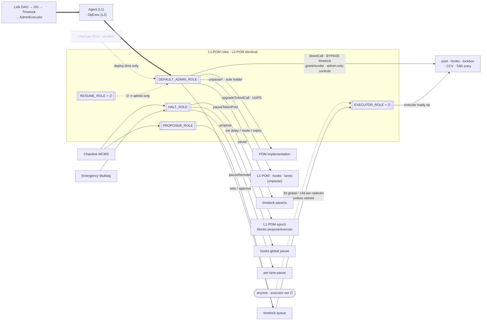

# Permissions & Roles — wsteth-2.0

> **September 15 deployment:** use [Current deployment and POM permissions](CURRENT-DEPLOYMENT.md)
> and the [deployment report](deployment-2026-09-15.md). The detailed POM descriptions below
> are historical: proposal modes, guardian/veto/approval APIs and combined pause roles no longer apply.

The **complete authority model** of `wsteth-2.0`: every actor, every role, who holds it, and what it
lets them do. This is the detailed companion to [`ARCHITECTURE.md`](./ARCHITECTURE.md) — that file
carries the topology and the diagrams (and a compact authority spine in its §3); this file is the
authoritative source for *permissions*.

**Scope & caveats.**
- **What this matrix is about.** It states the **intended production authority model** — Lido DAO
  governance on **Ethereum mainnet (L1)** reaching an **OP-stack L2** — after the full
  hand-over: deploy-time roles (held by the deployer) are transferred to governance and the deployer is
  revoked everywhere ([§5](#5-end-state-matrix)). The role-holders are the **real-world identities**
  named in [§1](#1-actors) (Lido DAO Agent, Emergency Multisig, Chainlink MCMS, Guardian).
- **That model is not the model of anything deployed.** Nothing is on mainnet. The governance
  principals *are* now distinct addresses on the current record — deployer, Emergency Multisig
  (holding both `guardian` and `emergency_brakes`, by design) and Chainlink MCMS — but they are
  single EOAs we control, not the multisigs and committees the rows name. Read every "distinct actor"
  row for its *holder*, not its *nature*; see [§4.3](#43-guardian-and-pauser-holders) for exactly what
  obtains, and note that `config/chains.live-mantle/*` still collapses all four onto one key. The substrates that exist are
  listed once, in [`README.md` §1.1](../README.md#11-substrates--the-canonical-status-claim); contract
  addresses live in `state/*.json` and `config/chains*/` (the source of truth), not here.
- **Verification.** This matrix is what Claim A / **state-mate** diffs against the deployment
  (`config/state-mate/wsteth.yaml`, **73 assertions**) — see [§6](#6-verification). What it
  structurally cannot see is [§2.2.4](#224-what-claim-a-does-not-pin).
- **The two chains are no longer configured identically.** One row of the POM selector filter
  differs: `unpause()` (`0x3f4ba83a`) is `Blocked` on the **L1 hub** and deliberately **not** blocked
  on any **non-L1 spoke**, so Chainlink MCMS can queue `hooks.unpause()` there and restart the bridge
  after **3 days**, while on L1 the same call reverts. Rationale and cost:
  [`config/README.md`](../config/README.md) § *The hub/spoke row*; full matrices:
  [`PAUSES.md`](./PAUSES.md). Rows below that say "admin-only unpause" are statements about
  **function gates**, which are identical on both chains — never about reachability through the
  proposal queue, which is not.
- **View.** This is the `SecurityTrustBoundary` structure of `ARCHITECTURE.md` §3, expanded.

---

## 1. Actors

The systems that *bear authority* on the live network. Each row is a real-world holder; on the disposable
forks used to validate the model these are stand-in anvil keys (the address source of truth is
`config/chains/*.json`, not this table).

| Actor                   | Real-world identity (live network)                                                                                                                                                                                               | Set in                 |
| ----------------------- | -------------------------------------------------------------------------------------------------------------------------------------------------------------------------------------------------------------------------------- | ---------------------- |
| **Aragon Agent** (L1)   | Lido DAO Agent — the on-chain governance root                                                                                                                                                                                    | step 01                |
| **OpExec** (L2)         | `OptimismBridgeExecutor` — the L2 governance executor, pinned to Agent                                                                                                                                                           | step 02                |
| **Deployer EOA**        | the deployment key — **revoked from every admin/owner role at end-state** (two pinned residuals remain during the live-testnet interim: OpExec cancel-guardian, §3.7, and CCV `allowlistAdmin`, §3.9 — both asserted by Claim A) | env                    |
| **Emergency Multisig**  | `emergency_brakes` — Lido emergency-pause multisig                                                                                                                                                                               | `config/chains/*.json` |
| **Chainlink MCMS**      | `chainlink_mcms` — Chainlink Many-Chain Multisig (proposer + a pauser)                                                                                                                                                           | `config/chains/*.json` |
| **Guardian**            | `guardian` — the proposal veto/approve guardian, **kept distinct from the halters**                                                                                                                                              | `config/chains/*.json` |
| **Chainlink Executors** | `chainlink_executors` — if left empty ⇒ **anyone** may execute a ready proposal                                                                                                                                                  | `config/chains/*.json` |
| **TokenPool**           | the CCIP token handler; sole authorized caller of hooks + lockbox                                                                                                                                                                | step 04/05             |

> The deployed contracts (`L1-POM` / `L2-POM`, pool, hooks, lockbox, TAR, token) also *bear roles over each other* —
> covered per-contract in [§3](#3-per-contract-permissions). For what each contract **does** (its Work),
> see `ARCHITECTURE.md` §2. For the actor-by-actor roll-up of what every one of them may (and may not)
> do at end-state — including the Chainlink/OP authorities this table omits — see
> [§2.2](#22-actor-capability-matrix--end-state).

---

## 2. Authority spine

One trust root, reaching both chains:

```
Lido DAO ─▶ DualGovernance ─▶ Timelock ─▶ AdminExecutor ─▶ Agent ─┬─ (L1) DEFAULT_ADMIN of L1-POM
                                                                  └─ (L2) → OpExec → DEFAULT_ADMIN of L2-POM
                              L1-POM / L2-POM ── owner ─▶ pool / hooks / lockbox / CCV ;  admin ─▶ TAR token entry
```

- **Agent** is the only authority above both POMs — **`L1-POM`** directly, **`L2-POM`** via `OpExec`.
- **`L1-POM` / `L2-POM`** is the only `owner`/admin above *its own chain's* pool, hooks, lockbox, CCV
  stack, and TAR token entry.
- The L2 leg is **pinned**: `OpExec.ethereumGovernanceExecutor == Agent`, so a forged L1 sender cannot
  drive `OpExec`.

> **Naming.** `L1-POM` and `L2-POM` are the two `PoolOperationManager` deployments — independent
> contracts with independent state, differing in admin (Agent vs `OpExec`) and in reachability (L2 sits
> behind the OP messenger). Written together as `L1-POM` / `L2-POM`, a statement holds on both.

### 2.1 The complete levers map — every actor, role, and lever

The whole authority model on one page, read **left → right**: an **actor** *holds* a **role** on `L1-POM` / `L2-POM`,
and that role *unlocks* one or more **levers** (the actual callable functions), each of which *acts on* a
**target**. The end-state holders are the §1 actors; the levers are the per-contract functions detailed
in [§3](#3-per-contract-permissions); the pause levers are designed in [§4](#4-the-opsmanager-pom-pause-design).
Identical on both chains — substitute **Agent → OpExec** for the L2 admin.

```
 ACTOR  (end-state holder)         ROLE on L1-POM / L2-POM      LEVER it unlocks                                       acts on  ▸ TARGET
 ─────────────────────────────     ───────────────────────      ─────────────────────────────────────────────        ─────────────────────────────────
 Lido DAO ▸ DG ▸ Timelock                                   ┌── upgradeToAndCall(newImpl,data) [POM UUPS] ───────────▶ L1-POM / L2-POM implementation
   ▸ AdminExecutor ▸ Agent (L1) ─┐                          ├── directCall(target,val,data)  [TIMELOCK BYPASS] ──────▶ pool · hooks · lockbox · CCV · TAR entry
                  · OpExec (L2) ─┴▶ DEFAULT_ADMIN_ROLE ─────┼── grant / revoke ANY role ─────────────────────────────▶ L1-POM / L2-POM role set
                                                            ├── veto · approve · timelock setters [ADMIN-ONLY] ────▶ proposal queue / parameters
                                                            ├── onlyRoleOrAdmin ⇒ pause / unpause levers ─────────▶ queue · hooks · lanes
                                                            │     … but NOT propose / cancel — those are plain onlyRole(PROPOSER_ROLE)
                                                            └── unpause* (sole holder — UNPAUSER = ∅) ───────────────▶ L1-POM / L2-POM epoch · hooks · lanes
 Chainlink MCMS ──────────────────▶ PROPOSER_ROLE ───────────── propose(op) ─────────▶ timelock queue ─┐
                                                                                     (3d global delay / │ 14d per-selector)
 anyone  (EXECUTOR set = ∅) ──────▶ EXECUTOR_ROLE = ∅ ───────── execute(ready op) ───────────────────────▶ pool · hooks · lockbox · CCV · TAR entry
 Emergency Multisig ──────────────┐
 Chainlink MCMS ──────────────────┴▶ HALT_ROLE ───┬── pause()             ─────────▶ L1-POM / L2-POM epoch (blocks propose/cancel/execute)
                                                    ├── pauseTokenPool()    ─────────▶ hooks GLOBAL pause (all lanes, both directions)
                                                    └── pauseRemoteLanes([])─────────▶ per-(selector,direction) lane pause on hooks
 (no holder) ─────────────────────▶ RESUME_ROLE = ∅   ⇒  unpause / unpauseTokenPool / unpauseRemoteLanes are ADMIN-ONLY (Agent/OpExec)
                                     …at the GATE. Through the QUEUE: MCMS reaches hooks.unpauseRemoteLanes() at 3 d on both chains,
                                     and hooks.unpause() at 3 d on a NON-L1 spoke (0x3f4ba83a Blocked on L1 only) — see PAUSES.md §3
 Deployer EOA ────────────────────▶ (revoked from every role at end-state — Claim A asserts `false`)

 ── Levers that do NOT route through L1-POM / L2-POM roles ───────────────────────────────────────────────────────────────────────
 L1 TokenPool (authorizedCaller) ─▶ deposit / withdraw on the lockbox  ·  lockOrBurn / releaseOrMint  (gated by Router on/off-ramp)
 L2 TokenPool                     ─▶ MINTER_ROLE / BURNER_ROLE on L2 wstETH — mint on receive / burn on send
 OpExec                           ─▶ L2 wstETH DEFAULT_ADMIN_ROLE + proxy admin  ·  pinned: ethereumGovernanceExecutor == Agent
```

*Rendered view (`L1-POM` levers shown; `L2-POM` is identical with Agent→OpExec):*



> **How to read the admin column.** `DEFAULT_ADMIN_ROLE` (Agent/OpExec) is the super-lever: via
> `onlyRoleOrAdmin` it can pull *every* other role's lever without holding that role, plus `directCall`
> (the timelock bypass) and grant/revoke. That is why `RESUME_ROLE` and `EXECUTOR_ROLE` are
> intentionally **empty** (∅) — unpausing falls to the admin alone, and an empty executor set means
> **anyone** may push a ready proposal over the line. The deployer edge is dashed because it exists only
> at deploy-time and is **revoked** at end-state ([§5](#5-end-state-matrix)).

### 2.2 Actor capability matrix — end-state

> **How to read this (`A.6.P`, `A.2.2`, `A.6.B`).** *Capability* is an overloaded word, so this matrix
> does not use it loosely. Every **May do** cell is a **grant claim (`D-*`)** — one named beneficiary,
> one action, and the conditions under which it may perform it. It is **not** a `U.Capability`
> (`A.2.2`): holding a grant says nothing about whether the holder's keys, quorum or operators can
> actually be brought to bear. Each grant is paired with the **gate (`A-*`)** the contract actually
> evaluates at call time, and with the **evidence (`E-*`)** that settles that the grant obtains
> on-chain (Claim A / `E-STATE-01`, [§6](#6-verification)). Grants cite gates and evidence; gates never
> cite grants (`A.6.B` §8.4.1 step 4).
>
> Two things this matrix deliberately does **not** do. It does not rank actors by "how much power" —
> the comparison is set-valued, not scalar (`A.19`/`G.5`, the same guard as `ARCHITECTURE.md` §5.3).
> And it lists **grants, not exercises**: an actual pause is dated `U.Work` (`A.15`) evidenced by a
> receipt, not by a row here.
>
> Rows hold on **both chains** unless marked; substitute **Agent → OpExec** for the L2 admin.

#### 2.2.1 Actors that bear authority inside the boundary

| ID           | Actor                                       | Holds                                                                                                                                                                                                                                                                                                                                                                                                                                                  | May do — grant (`D`)                                                                                                                                                                                                                                                                                                                                                                                                                                                                                                                                                             | Gate that admits it (`A`)                                                                                                                                                                                                                                                                | Does **not** hold                                                                                                                                                                                                           | Pinned by (`E-STATE-01`)                                                                                                                                                                                                                                                                              |
| ------------ | ------------------------------------------- | ------------------------------------------------------------------------------------------------------------------------------------------------------------------------------------------------------------------------------------------------------------------------------------------------------------------------------------------------------------------------------------------------------------------------------------------------------ | -------------------------------------------------------------------------------------------------------------------------------------------------------------------------------------------------------------------------------------------------------------------------------------------------------------------------------------------------------------------------------------------------------------------------------------------------------------------------------------------------------------------------------------------------------------------------------- | ---------------------------------------------------------------------------------------------------------------------------------------------------------------------------------------------------------------------------------------------------------------------------------------- | --------------------------------------------------------------------------------------------------------------------------------------------------------------------------------------------------------------------------- | ----------------------------------------------------------------------------------------------------------------------------------------------------------------------------------------------------------------------------------------------------------------------------------------------------- |
| **D-ACT-01** | **Agent** (L1) / **OpExec** (L2)            | `L1-POM` / `L2-POM` `DEFAULT_ADMIN_ROLE`                                                                                                                                                                                                                                                                                                                                                                                                               | UUPS `upgradeToAndCall(newImplementation,data)` on the POM proxy; `directCall(target,value,data)` — one arbitrary call on pool · hooks · lockbox · CCV · TAR entry, **no delay, no veto**; `grantRole`/`revokeRole`; `setTokenPool`; admin-only `veto` · `approve` · all five timelock setters; and via `onlyRoleOrAdmin`: all pause and unpause levers                                                                                                                                                                                             | `onlyRole(DEFAULT_ADMIN_ROLE)` for UUPS authorization, `directCall`, `setTokenPool`, role admin, veto/approval and timelock setters; `onlyRoleOrAdmin(X)` for pause/resume                                                                                                                                 | `propose` / `cancel` — both are plain `onlyRole(PROPOSER_ROLE)` with **no admin bypass**; the admin would first have to grant itself `PROPOSER_ROLE` (a separate, observable tx). Also not an explicit `HALT_ROLE` member | `DEFAULT_ADMIN_ROLE` = agent/opExec `true`, deployer `false`; `UPGRADE_INTERFACE_VERSION = 5.0.0`; `HALT_ROLE` = agent/opExec `false`; `RESUME_ROLE` = agent/opExec `false`                                                                                                                      |
| **D-ACT-02** | **OpExec** — its L2 leg beyond `L2-POM`     | L2 wstETH `DEFAULT_ADMIN_ROLE` + owner of the token `ProxyAdmin`; CCV `feeAggregator` (L2)                                                                                                                                                                                                                                                                                                                                                                     | grant/revoke `MINTER_ROLE` / `BURNER_ROLE` on L2 wstETH; `upgradeAndCall` / `transferOwnership` / `renounceOwnership` on the token `ProxyAdmin`; receives swept CCV fees                                                                                                                                                                                                                                                                                                                                                                                     | `onlyRole(DEFAULT_ADMIN_ROLE)` on the token; `onlyOwner` on the ProxyAdmin. OpExec itself only ever acts on an **executed action set** — see the note below                                                                                                                                   | anything on L1                                                                                                                                                                                                              | `ProxyAdmin.owner() = opExec` (ProxyAdmin = EIP-1967 admin slot of the proxy); `DEFAULT_ADMIN_ROLE` = opExec `true`, deployer `false`; `getFeeAggregator = opExec`                                                                                                                                                                                       |
| **D-ACT-03** | **Chainlink MCMS**                          | `L1-POM` / `L2-POM` `PROPOSER_ROLE` + `HALT_ROLE`                                                                                                                                                                                                                                                                                                                                                                                                    | `propose(...)` into the timelock queue — `delay` must lie in `[getSelectorMinDelay(sel), globalExpiryPeriod]` (3 d global, **14 d** on the selectors carrying an override — §3.1) and the selector must not be `Blocked`; `cancel(id)` **any** `Waiting`/`Ready`/`ApprovalRequired` proposal, including ones it did not create; `pause` · `pauseTokenPool` · `pauseRemoteLanes`                                                                                                                                                                                                  | `onlyRole(PROPOSER_ROLE) whenNotPaused` (propose/cancel); `onlyRoleOrAdmin(HALT_ROLE)` (pause)                                                                                                                                                                                         | call any `unpause*` **directly**; `veto`/`approve`; the timelock parameters; `directCall`. **Indirectly it can unpause**: `propose(hooks, unpauseRemoteLanes(…))` at 3 d on both chains, and `propose(hooks, unpause())` at 3 d on a **non-L1 spoke** (`0x3f4ba83a` is `Blocked` on L1 only)                                                                                                                                                     | `PROPOSER_ROLE` = chainlink_mcms `true`; `HALT_ROLE` = chainlink_mcms `true`                                                                                                                                                                                                                        |
| **D-ACT-04** | **Emergency Multisig** (`emergency_brakes`) | `L1-POM` / `L2-POM` `HALT_ROLE`                                                                                                                                                                                                                                                                                                                                                                                                                      | `shutdownProposalQueue()` → epoch++ (**invalidates every in-flight proposal**) and blocks `propose`/`cancel`/`execute`; `pauseTokenPool()` → hooks global pause, both directions, every lane; `pauseRemoteLanes([...])` → per-`(selector, direction)`                                                                                                                                                                                                                                                                                                                                 | `onlyRoleOrAdmin(HALT_ROLE)`; queue shutdown additionally `whenNotPaused`                                                                                                                                                                                                             | every `unpause*` — `RESUME_ROLE` is ∅, so at the gate **only the admin can restart**, and on L2 that means a fresh L1→L2 governance message. On a spoke MCMS may propose `hooks.unpause()` after three days unless the DAO admin vetoes; sustaining the halt without relying on that veto means escalating to `shutdownProposalQueue()` (epoch++). Also no propose/veto/params/upgrade/`directCall`                       | `HALT_ROLE` = emergency_brakes `true`                                                                                                                                                                                                                                                               |
| **D-ACT-06** | **anyone**                                  | no role — the **empty `EXECUTOR_ROLE` set is itself the grant**                                                                                                                                                                                                                                                                                                                                                                                        | `execute(target,value,data,predecessor,salt)` on any `Ready`, un-vetoed, unexpired proposal of the current epoch; `OpExec.execute(actionsSetId)` on a queued L2 action set inside its grace window; `verifier.withdrawFeeTokens(tokens)`                                                                                                                                                                                                                                                                                                                                         | `if (getRoleMemberCount(EXECUTOR_ROLE) != 0) _checkRole(EXECUTOR_ROLE)` — empty set ⇒ no check at all; plus `whenNotPaused` and the `Ready` state test                                                                                                                                   | choose *what* executes (payload is fixed at propose-time); execute while paused, after an epoch bump, or past expiry; redirect the swept fees (destination is the fixed `feeAggregator`)                                    | `getRoleMemberCount(EXECUTOR_ROLE) = 0` on both POMs                                                                                                                                                                                                                                                       |
| **D-ACT-08** | **`L1-POM`** / **`L2-POM`** — as an actor   | `owner` of pool · hooks · lockbox · verifier · resolver; TAR per-token `administrator`                                                                                                                                                                                                                                                                                                                                                                 | every `onlyOwner` lever on those. **pool:** `applyChainUpdates` · `setRateLimitConfig` · `setDynamicConfig` · `updateAdvancedPoolHooks` · `addRemotePool`/`removeRemotePool` · `setAllowedFinalityConfig` · `applyTokenTransferFeeConfigUpdates` · `configureLockBoxes` (L1). **hooks:** `pause`/`unpause`(+lane variants) · `applyCCVConfigUpdates` · `setThresholdAmount` · `setPolicyEngine`. **lockbox:** `applyAuthorizedCallerUpdates`. **CCV:** `setDynamicConfig` · `applyRemoteChainConfigUpdates` · `updateStorageLocations`. **TAR:** `setPool` · `transferAdminRole` | `onlyOwner`; `onlyTokenAdmin(token)` on the TAR                                                                                                                                                                                                                                          | **act on its own** — neither `L1-POM` nor `L2-POM` has an autonomous path. Every lever above is reachable only through a role-holder's `directCall` or an executed proposal                                                 | `owner = POM` on l1/l2 pool, hooks, lockbox, verifier, resolver; TAR `getTokenConfig = [POM, 0, pool]`                                                                                                                                                                                                |
| **D-ACT-09** | **L1 TokenPool**                            | lockbox `authorizedCaller`                                                                                                                                                                                                                                                                                                                                                                                                                             | `lockbox.deposit` / `lockbox.withdraw` — the entire locked principal of a lane's box                                                                                                                                                                                                                                                                                                                                                                                                                                                                                             | `_validateCaller()` on the lockbox — and the pool only reaches those calls from `lockOrBurn`/`releaseOrMint`, themselves behind `msg.sender == Router.getOnRamp(sel)` / `Router.isOffRamp(sel, msg.sender)`, `!RMN.isCursed(sel)`, `A-RL-01`, and the hooks' pre/postflight (`A-CCV-01`) | draw from another lane's box (`L-SILO-01`)                                                                                                                                                                                  | `getAllAuthorizedCallers = [l1Pool]`                                                                                                                                                                                                                                                                  |
| **D-ACT-10** | **L2 TokenPool**                            | L2 wstETH `MINTER_ROLE` + `BURNER_ROLE`                                                                                                                                                                                                                                                                                                                                                                                                                | `mint(to, amount)` — unbounded at the token itself; `burn(amount)` from its own balance                                                                                                                                                                                                                                                                                                                                                                                                                                                                                          | `onlyRole(MINTER_ROLE)` / `onlyRole(BURNER_ROLE)`; the same ramp · RMN · `A-RL-01` · hooks chain sits above it                                                                                                                                                                           | anything else on the token                                                                                                                                                                                                  | `MINTER_ROLE` = l2Pool `true`; `BURNER_ROLE` = l2Pool `true`                                                                                                                                                                                                                                          |
| **D-ACT-07** | **Deployer EOA**                            | **no `L1-POM` / `L2-POM` role at all, plus two residuals.** `L-SEP-01` holds on the current record: `chainlink_mcms`, `emergency_brakes` and the deployer are three distinct addresses (the first two derived from `ACTORS_MNEMONIC`), and all five POM roles read `false` for the deployer on both chains — `DEFAULT_ADMIN`, `PROPOSER`, `HALT`, `RESUME`, `EXECUTOR`. The residual set is the intended **two**, both outside the POM (§4.3) | under `L-SEP-01`, two pinned live-testnet-interim residuals: `OpExec.cancel(actionsSetId)` as the OpExec **cancel guardian** — kills any queued L2 governance action set; `verifier.applyAllowlistUpdates(...)` as CCV **`allowlistAdmin`** on both chains (inert on the 1.5 transport, §3.9)                                                                                                                                                                                                                                                                                    | `onlyGuardian` on OpExec; `msg.sender == owner() \|\|allowlistAdmin` on the verifier                                                                                                          | under `L-SEP-01`, everything else — every admin/owner check asserts `false`, including everything `D-ACT-03` and `D-ACT-04` may do                                                                                                             | `getGuardian = deployer`; `getDynamicConfig = [agent\|opExec, deployer]` on both verifiers; `DEFAULT_ADMIN_ROLE` = deployer `false` on both POMs **and** the L2 token                                                                                                                                 |

**How `OpExec` is itself driven (`D-ACT-02` gate).** `queue(...)` is `onlyEthereumGovernanceExecutor`:
`msg.sender` must be the OP `L2CrossDomainMessenger` (`0x4200000000000000000000000000000000000007`) **and**
`messenger.xDomainMessageSender()` must be the L1 **Agent**. `delay = 0`, grace period `1 day`, and
`execute(actionsSetId)` is permissionless (`D-ACT-06`). Pinned: `getEthereumGovernanceExecutor = agent`.

> **The governance controls are admin-only.** Current upstream POM has no `GUARDIAN_ROLE`.
> `veto`, `approve`, the five timelock setters, and UUPS `_authorizeUpgrade` require
> `DEFAULT_ADMIN_ROLE`, so Agent / OpExec can use them immediately, with no POM proposal, delay,
> or veto window:
> - `setGlobalMinDelay(0)` zeroes the delay for every selector **without** an explicit override — the
>   contract documents that in `Veto` mode this makes proposals immediately executable, erasing the
>   admin's veto window. The selectors carrying a 14-day override keep it *until* `setSelectorMinDelay(sel, 0)`
>   drops each back to the global value (`0` means "no override"), so two transactions remove the
>   timelock entirely.
> - `setGlobalProposalMode(Blocked)` is accepted (only `None` is rejected) — every selector without an
>   override then reverts `BlockedSelector` on `propose`. `setSelectorMode(sel, Blocked)` does the same
>   for one selector.
> - `setGlobalExpiryPeriod(x)` with `x < minDelay` makes every `propose` revert `InvalidDelay`.
> These are self-inflicted-only: the same body that owns the timelock owns the dial. Step 08 pins
> the active UUPS interface and selector policy; `RealPomUpgrade` separately rehearses authorization
> and state preservation.
>
> Mitigation is detection, not prevention: Claim A pins mode, global delay and the per-selector delays,
> and each setter emits (`MinDelaySet`, `GlobalProposalModeSet`, `ExpiryPeriodSet`, `SelectorMinDelaySet`,
> `SelectorModeSet`). The DAO's own path (`directCall`) is unaffected by all of it.

#### 2.2.2 Authorities outside the boundary — Chainlink / OP, none of which we hold

Named here rather than omitted, because they bound every claim above (`A.1.1`: state the crossing, do
not silently drop it).

| ID | Actor | What it may do **to this system** | Gate | Anything on our side? |
|---|---|---|---|---|
| **D-EXT-01** | CCIP **Router owner** (Chainlink) | `applyRampUpdates` — decides which OnRamp/OffRamp addresses satisfy our pool's `_onlyOnRamp` / `_onlyOffRamp`, i.e. selects **who may call** `lockOrBurn` / `releaseOrMint` | `onlyOwner` on `Router` | Only indirectly: `L1-POM` / `L2-POM` can repoint the pool at a different router (`setDynamicConfig` — 14-day proposal, or immediate via `directCall`) |
| **D-EXT-02** | **RMN** curse authority (Chainlink) | `isCursed(selector)` ⇒ both `lockOrBurn` and `releaseOrMint` revert — a unilateral halt of the lane in both directions, which we cannot lift | checked inside `TokenPool` on every transfer | No. `i_rmnProxy` is immutable in the pool; changing it means deploying a new pool |
| **D-EXT-03** | CCIP **OnRamp / OffRamp** | the only callers of the value path; the OffRamp is where the 2-of-2 CCV quorum (`A-CCV-01`) is enforced | `_onlyOnRamp` / `_onlyOffRamp` via the Router | No — and note `A-CCV-01` is **relaxed on 1.5-only lanes** (`ARCHITECTURE.md` §6) |
| **D-EXT-04** | the two **CCV verifiers** of the real quorum | withholding an attestation blocks every inbound transfer on the lane | OffRamp 2.0 quorum check | No |
| **D-EXT-05** | **TAR owner + registry modules** (Chainlink) | `addRegistryModule` / `removeRegistryModule`; `proposeAdministrator(token, admin)` | `onlyOwner` / registry-module | **Cannot touch our entry**: `proposeAdministrator` reverts `AlreadyRegistered` once `administrator != 0`. Our entry is `(L1-POM / L2-POM, pending = 0, pool)` — pinned |
| **D-EXT-06** | OP **`L2CrossDomainMessenger`** (`0x4200000000000000000000000000000000000007`) and the OP sequencer | delivers — or fails to deliver — L1→L2 governance messages; it is the only `msg.sender` `OpExec.queue` accepts | `onlyEthereumGovernanceExecutor` | No. Liveness of the L1→L2 governance path is an OP dependency |

#### 2.2.3 Pinned-empty slots — principals that hold nothing

The absences are load-bearing, so they are claims too.

| ID | Slot | End-state value | Why it matters | Pinned? |
|---|---|---|---|---|
| **L-NEG-01** | `L1-POM` / `L2-POM` `RESUME_ROLE` | ∅ | unpausing is admin-only; every pause is one-way until governance acts | **yes** — Claim A pins member count 0 |
| **L-NEG-02** | `L1-POM` / `L2-POM` `EXECUTOR_ROLE` | ∅ | the empty set **is** what grants `D-ACT-06`; a non-empty set would silently restrict execution to its members | **yes** — Claim A pins member count 0 |
| **E-NEG-03** | pool `rateLimitAdmin` | `0x0` | `setRateLimitConfig` is owner-**or**-`rateLimitAdmin`; zero means no shadow admin can retune `A-RL-01` outside `L1-POM` / `L2-POM` | `getDynamicConfig: [router, 0, 0]`, both chains |
| **E-NEG-04** | pool `feeAdmin` | `0x0` | pool fee withdrawal stays owner-only | same check |
| **L-NEG-05** | hooks sender allowlist | **immutably disabled** — constructed with an empty allowlist, so `i_allowlistEnabled == false` and `applyAllowListUpdates` reverts `AllowListNotEnabled` even for `L1-POM` / `L2-POM` | there is no per-sender gate on the hooks; the gates are CCV, rate limit, and pause | no — fixed by constructor args |
| **L-NEG-06** | hooks `policyEngine` | `0x0` at deploy | no external policy contract sits in the transfer path today; `L1-POM` / `L2-POM` **can** insert one later via `setPolicyEngine` | no |
| **L-NEG-07** | L2 wstETH legacy `bridge` | **absent** — the immutable and its `bridgeMint`/`bridgeBurn` pair are removed from the base source (pinned branch `feat/token-upgrade`), not merely set to `address(0)` | `bridgeMint` / `bridgeBurn` are not on the deployed ABI at all — minting and burning are `MINTER_ROLE`/`BURNER_ROLE` only | step 03 asserts `bridge()` is absent on-chain |
| **A-UPG-01** | `L1-POM` / `L2-POM` upgrade path | UUPS behind `ERC1967Proxy`; `_authorizeUpgrade` requires `DEFAULT_ADMIN_ROLE` | Agent / OpExec may call `upgradeToAndCall` directly. The target-blind proposal selector `0x4f1ef286` is `Blocked`, preventing MCMS from routing a POM upgrade through the queue | interface + selector pinned by Claim A; authorization and state preservation rehearsed by `RealPomUpgrade` |
| **E-NEG-09** | TAR `pendingAdministrator` | `0x0` | no half-finished admin handover is sitting there waiting to be accepted | `getTokenConfig: [L1-POM / L2-POM, 0, pool]` |

#### 2.2.4 What Claim A does not pin

`B.3` congruence: the assurance claimed must not exceed the evidence. Claim A asserts **membership of
named addresses** and resolves each alias independently. Of the four gaps this section used to list,
three have since been closed in `config/state-mate/wsteth.yaml`; one remains.

**Still open — no principal-distinctness assertion (`L-SEP-01`).** `wsteth.yaml` asserts
`hasRole(ROLE, *alias)` per alias, so when several aliases resolve to the **same address** one key
satisfies every row and the run is green. Collapses among deployer / emergency_brakes /
chainlink_mcms remain **invisible to Claim A**. They do not obtain on the current
record, but nothing in the run would say so if they did. Closing this needs no new contract call:
`script/08_verify_state.sh` already derives its inputs from the record, so a pairwise-distinctness
assertion over `governance_addresses` would turn `L-SEP-01` from an intention into an `E-*` result.
Tracked as `FPF-REVIEW.md` R-06.

**Closed since.**

| Was unpinned | Now |
|---|---|
| `EXECUTOR_ROLE` — `D-ACT-06` ("anyone may execute") documented but unverified | `getRoleMemberCount(EXECUTOR_ROLE) = 0` asserted on both POMs (`wsteth.yaml:610`, `:1160`) — a grant to any address now fails Claim A |
| no `getRoleMemberCount` assertions, so an *extra* role holder was invisible | full cardinality block on both POMs: `DEFAULT_ADMIN 1`, `PROPOSER 1`, `HALT *haltRoleMemberCount`, `RESUME 0`, `EXECUTOR 0` |
| no POM ↔ pool ↔ hooks binding check | `getTokenPool` and `getAdvancedPoolHooks` pinned on both POMs and on both pools; the hooks' and lockbox's `getAllAuthorizedCallers` pinned |

A fourth thing is verified in two complementary ways: Claim A pins the POM UUPS interface and
Blocked proposal selector; step 08 §4b resolves the ERC-1967 implementation and checks its
`proxiableUUID`. `RealPomUpgrade` supplies the state-changing authorization and preservation probe.

Until the remaining `L-SEP-01` carrier exists, read each "distinct actor" statement as intent.
The ∅ role rows are independently evidenced by their cardinality checks.

---

## 3. Per-contract permissions

### 3.1 PoolOperationManager (POM) — the operations gate + timelock

`AccessControlEnumerableUpgradeable` + `PausableUpgradeable` + `UUPSUpgradeable`, behind an
`ERC1967Proxy` — one per chain, **`L1-POM`** and **`L2-POM`**.
Owns the pool/hooks/lockbox/CCV and gates all operations on them. `directCall` is the admin's
timelock-bypass; proposer operations route through a propose → delay → optional admin veto → execute timelock.

**Roles** (`keccak256("<NAME>")`):

| Role | Holder — L1 | Holder — L2 | What it authorizes |
|---|---|---|---|
| `DEFAULT_ADMIN_ROLE` | **Agent** | **OpExec** | UUPS `upgradeToAndCall`; admin-only veto/approve and timelock setters; every `onlyRoleOrAdmin` pause/resume lever — but **not** `propose`/`cancel`; `directCall` (timelock bypass); `setTokenPool`; grant/revoke all roles |
| `PROPOSER_ROLE` | Chainlink MCMS | Chainlink MCMS | `propose` operations into the timelock |
| `EXECUTOR_ROLE` | *(none — `[]`)* | *(none — `[]`)* | `execute` a ready proposal; **empty set ⇒ anyone may execute** |
| `HALT_ROLE` | Emergency Multisig + Chainlink MCMS | Emergency Multisig + Chainlink MCMS | `pause` / `pauseTokenPool` / `pauseRemoteLanes` |
| `RESUME_ROLE` | *(none — `[]`)* | *(none — `[]`)* | `unpause` / `unpauseTokenPool` / `unpauseRemoteLanes` |

**`onlyRoleOrAdmin` semantics.** Functions carrying that modifier also accept `DEFAULT_ADMIN_ROLE`, so
Agent/OpExec can pause and unpause **without** holding those roles explicitly. Veto, approval,
timelock setters, and UUPS authorization are directly admin-only. This is why `RESUME_ROLE` is intentionally **unassigned** — only the admin
(Agent/OpExec) can unpause — and why Agent/OpExec are **not** in the explicit `halters` set.

> **"Admin-only unpause" is about the POM's own `unpause*` entry points.** The hooks' `unpause()` /
> `unpauseRemoteLanes()` are `onlyOwner` and the owner is the POM, so an executed proposal reaches
> them without anyone holding `RESUME_ROLE`. `unpauseRemoteLanes` is 3 d on both chains;
> `unpause` is 3 d on a **non-L1 spoke** and `Blocked` on **L1**. `PAUSES.md` §2–§5.

> **`propose` and `cancel` are the exception — there is no admin bypass on them.** Both are plain
> `onlyRole(PROPOSER_ROLE)`, so Agent/OpExec cannot queue or cancel a proposal directly; the admin's
> immediate path is `directCall`, and to use the queue it would first have to grant itself
> `PROPOSER_ROLE` (a separate, observable transaction). `execute` likewise checks `EXECUTOR_ROLE` with a
> plain `_checkRole` — harmless at end-state only because that set is empty ([§2.2](#22-actor-capability-matrix--end-state)).

**`directCall(target, value, data)`** — `onlyRole(DEFAULT_ADMIN_ROLE)`. Executes an arbitrary call on
any target (i.e. the pool/hooks/lockbox) **bypassing the timelock**. This is the DAO's immediate path
(used by the governance round-trip in Claim B and every config change in the scenarios).

**Timelock** (from `lib/ccip/.../lido-hvmv/config/default_config.json`, applied at deploy):

| Parameter | Value |
|---|---|
| `proposal_mode` | **Veto** (proposals execute after the delay unless the DAO admin vetoes, or Emergency `shutdownProposalQueue()` voids the queue via epoch++) |
| global min delay | **3 days** (`259200 s`) |
| validity / expiry period | **30 days** (`2592000 s`) |
| per-selector delay (set in `2_Configure` from **our** `config/default_config.json`, injected via `DEFAULT_CONFIG`) | **14 days** (`1209600 s`) on six selectors: `transferAdminRole` (`0xddadfa8e`), `setPool` (`0x4e847fc7`), `setDynamicConfig` on the pool (`0xae39a257`) and on the CCV verifier (`0x869b7f62`), `updateAdvancedPoolHooks` (`0xbfeffd3f`), `configureLockBoxes` (`0xefd07eec`). `lido-proposals` now carries `transferAdminRole` and `setPool`; the CCV overload is still ours, as is the hooks `unpause()` Block — which applies to the **L1 hub only** (`config/default_config.non_l1.json` omits it, opening a 3-day MCMS restart on every spoke). See [`PARAMETERS.md`](./PARAMETERS.md) §0.2 / `P-POM-05` |

**Pause surfaces** (three independent, no cross-triggering) — see the full design in [§4](#4-the-opsmanager-pom-pause-design).

### 3.2 PausableAdvancedPoolHooks

The pool's policy enforcer (CCV requirements, rate-limit, pause). One per chain.

- **`owner` = `L1-POM` / `L2-POM`** (end-state; transferred + `acceptOwnership` in `2_Configure`).
- **`authorizedCaller` = the TokenPool** (set at construction) — only the pool may invoke
  `preflightCheck` / `postflightCheck`.
- **`onlyOwner` (⇒ `L1-POM` / `L2-POM`) functions:** `pause()`, `unpause()`, `pauseRemoteLanes(RemoteLane[])`,
  `unpauseRemoteLanes(RemoteLane[])`, `applyCCVConfigUpdates(...)`, `setThresholdAmount(...)`.
- Because the owner is `L1-POM` / `L2-POM`, these are reachable only through its role gates (HALT/RESUME/admin) or
  `directCall`.
- **CCV config (per lane, deployed end-state):** base CCV set = the single verifier resolver for both
  `outboundCCVs` and `inboundCCVs` — **one entry, not two.** The resolver does not fan out; it maps a
  version tag to exactly one verifier implementation. How that one entry becomes the required set the
  OffRamp enforces is the gate `A-CCV-01`, stated once in
  [`README.md` §5](../README.md#5-claim-register--boundary-norms-a6b-lade).
  The **amount-threshold for *additional* CCVs is disabled** — `getThresholdAmount() == 0` and the
  `thresholdOutboundCCVs`/`thresholdInboundCCVs` sets are empty, so there is no large-transfer CCV
  escalation. (Enableable later via `setThresholdAmount` + `applyCCVConfigUpdates` through `L1-POM` / `L2-POM`.)
  state-mate pins both (`getThresholdAmount`, `getCCVConfig`).

### 3.3 TokenPool (L1 `SiloedLockReleaseTokenPool` / L2 `BurnMintTokenPool`)

- **`owner` = `L1-POM` / `L2-POM`** (end-state). The pool itself has **no pause** — pausing lives entirely in the hooks
  (§3.2); the pool delegates policy to its hooks.
- Caller gating on the value path: `lockOrBurn` requires `msg.sender == Router.getOnRamp(remoteSel)`;
  `releaseOrMint` requires `Router.isOffRamp(remoteSel, msg.sender)`. The pool's `s_router` is the
  network's CCIP Router.
- L2 pool holds `MINTER_ROLE` + `BURNER_ROLE` on the L2 token (§3.6); L1 pool is the sole authorized
  caller of the lockbox (§3.4).
- **Per-lane transfer rate limits (gate A-RL-01)** — set in `2_Configure` via `applyChainUpdates`, one
  token bucket per direction: **outbound (`lockOrBurn`/send) capacity 500e18**, **inbound
  (`releaseOrMint`/receive) capacity 330e18**, each refilling its full capacity over ~24h
  (`rate = capacity / 86400`; outbound `5787037037037037`, inbound `3819444444444444`). Both enabled on
  both lanes; values come from `lib/ccip/.../config/default_config.json`. Reconfigurable only by `L1-POM` / `L2-POM`
  (`onlyOwner` chain-update path). Pinned by state-mate (`getCurrentRateLimiterState`, isEnabled/capacity/
  rate, both lanes). Exercised by two harnesses at **different assurance grades** — the gating
  `RealLaneBridge.test_outbound_over_cap_reverts` / `test_inbound_over_cap_reverts` on the real forked
  ramps, and `CcvBridge.test_over_cap_rate_limit_reverts` /
  `test_over_cap_inbound_rate_limit_does_not_mint` on the **non-gating** self-owned-ramp harness. The
  carrier list for `A-RL-01` lives in [`README.md` §5](../README.md#5-claim-register--boundary-norms-a6b-lade);
  cite the ID rather than one harness (`CC-B3.1`: `K` is load-bearing).

### 3.4 ERC20LockBox (L1 only)

Per-lane custody of locked L1 wstETH (`L-SILO-01`: one box per remote lane).

- **`owner` = `L1-POM`** (end-state — the lockbox is L1-only). Owner manages the authorized-caller list.
- **`authorizedCaller` = the L1 TokenPool** — only the pool may `deposit` (on lock) / `withdraw`
  (on release).

### 3.5 TokenAdminRegistry (TAR, CCIP infra — one per chain)

Binds `token → (administrator, pool)`. The CCIP registry is Chainlink-owned infra; we only set our token's entry.

- **per-token `administrator` = `L1-POM` / `L2-POM`** (end-state). The administrator may `setPool(token, pool)` and
  `transferAdminRole(token, newAdmin)` (2-step). End-state entry: `(admin = L1-POM / L2-POM, pending = 0, pool = our pool)`.
- The TAR contract owner is Chainlink (registry-wide; out of scope — we don't hold it).

### 3.6 L2 wstETH — `ERC20BridgedPermit` behind `TransparentUpgradeableProxy` (OZ 5.3.0)

- **`DEFAULT_ADMIN_ROLE` = OpExec** (end-state; deployer revoked). Manages MINTER/BURNER membership.
- **`MINTER_ROLE` / `BURNER_ROLE` = the L2 TokenPool** — only the pool mints (on receive) / burns (on send).
- **ProxyAdmin owner = OpExec** — the proxy constructor created the `ProxyAdmin` (EIP-1967 admin slot) with OpExec as `initialOwner`; it controls `upgradeAndCall` / `transferOwnership` / the one-way `renounceOwnership`.
- **There is no fourth mint principal.** The base's legacy `bridge` authority — an immutable address
  privileged for `bridgeMint`/`bridgeBurn`, revocable only by an implementation upgrade — is removed
  from the source entirely, upstream in the pinned base (`lido-l2-with-steth @ feat/token-upgrade`;
  it was `patches/lido-l2-with-steth/0001` until 2026-09-02). Every principal that can move the L2
  supply is therefore a role in the table above, i.e. revocable by the OpExec and countable by
  `getRoleMemberCount`. Step 03 asserts on-chain that `bridge()` does not exist; step 08 asserts the
  role cardinalities.

### 3.7 OptimismBridgeExecutor (OpExec) — L2 governance executor

`BridgeExecutorBase` + Optimism cross-domain auth. Constructor (`script/DeployL2Gov.s.sol`):

| Param | Value | Meaning |
|---|---|---|
| `ovmL2CrossDomainMessenger` | `0x4200000000000000000000000000000000000007` (OP `L2CrossDomainMessenger`) | the only `msg.sender` allowed to deliver L1 messages |
| `ethereumGovernanceExecutor` | **L1 Agent** | the only `xDomainMessageSender` whose messages are accepted |
| `delay` | `0` | queue→execute delay (min) |
| `gracePeriod` | `1 day` | execution window after delay |
| `minimumDelay` / `maximumDelay` | `0` / `1 day` | bounds for self-updates |
| `guardian` | a real **cancel guardian** | the address allowed to `cancel` a queued action set |

- **`onlyEthereumGovernanceExecutor`** gates `queue(...)`: caller must be the L2 messenger **and**
  `messenger.xDomainMessageSender() == Agent`. This is the pinning that makes the L1→L2 path safe.
- **`onlyGuardian`** gates `cancel(actionsSetId)` — on the live network this is the configured cancel
  guardian. The deploy default (`DeployL2Gov`, no `OPEXEC_GUARDIAN` env) seats the **deployer** as
  guardian so `cancel()` stays usable as an emergency brake; rotating it afterwards requires a queued
  `updateGuardian` action (`onlyThis`). Claim A pins `getGuardian` so the cancel power cannot sit with
  an unexpected key — see [§7](#7-deployment-address-checklist).
- **`onlyThis`** (self-call via a queued action) gates `updateGuardian` / `updateDelay` /
  `updateGracePeriod` / `updateMinimumDelay` / `updateMaximumDelay` / `executeDelegateCall`.

### 3.8 L1 Dual Governance + Agent (trust root)

Standard Lido DG stack from step 01: `Voting → DualGovernance → EmergencyProtectedTimelock →
AdminExecutor → Agent`. The **Agent** is the on-chain actor that (a) holds L1-POM `DEFAULT_ADMIN_ROLE`
and (b) sends the L1→L2 message via `L1CrossDomainMessenger.sendMessage(opExec, calldata, gasLimit)`. DG internals
(reseal manager, escrow, etc.) are upstream and out of this matrix; what matters here is that **Agent is
the single authority** both `L1-POM` and `L2-POM` answer to.

### 3.9 CCV stack — `DummyMessageIdVerifier` + `VersionedVerifierResolver`

The persisted CCV stack (one verifier + one resolver per chain). Both are `Ownable2Step`.

- **`owner` = `L1-POM` / `L2-POM`** (end-state; transferred in `2_Configure`).
- `DummyMessageIdVerifier`: `feeAggregator = Agent`, `allowlistAdmin = deployer` (deploy default —
  never rotated by the pipeline; rotation needs `setDynamicConfig` from `L1-POM` / `L2-POM`). `onlyOwner`:
  `setDynamicConfig`, `applyRemoteChainConfigUpdates`, `updateStorageLocations`.
  `applyAllowlistUpdates` is callable by owner **or** `allowlistAdmin`. Claim A pins
  `owner` = `L1-POM` / `L2-POM` and `getDynamicConfig` (incl. `allowlistAdmin`) on both verifier and resolver.
- `VersionedVerifierResolver`: `onlyOwner` for inbound/outbound implementation updates + fee aggregator.

> **What this stack is and is not.** It is the *configuration and proof-check locus* our side
> declares — `A-CCV-01`'s required set draws its pool half from here. It is **not** the attesting
> operator set: the second quorum member in `RealCcvLane` is a test-local `MockCCV`, and on a real
> lane the other members are the OffRamp's `laneMandatedCCVs`. `A-CCV-01`'s membership is stated once,
> in [`README.md` §5](../README.md#5-claim-register--boundary-norms-a6b-lade) — do not re-describe it
> here (`A.6.B:6.1`).

---

## 4. The OpsManager (POM) pause design

The pause model in full. `L1-POM` / `L2-POM` is the "OpsManager" on its chain; pausing is gated by `HALT_ROLE` / `RESUME_ROLE`
(or `DEFAULT_ADMIN_ROLE` via `onlyRoleOrAdmin`).

### 4.1 Role → holder

| Role | Assigned to (intended) | Live-network holder |
|---|---|---|
| **Admin** | DAO Agent / GovernanceExecutor | `DEFAULT_ADMIN_ROLE` = Agent (L1) / OpExec (L2) |
| **Unpauser** | DAO Agent / GovernanceExecutor | **unassigned** — admin unpauses via `onlyRoleOrAdmin` (decision: rely on admin) |
| **Pause roles** | DAO Agent/GovExec, Emergency Multisig, Chainlink Pauser | `HALT_ROLE` = Emergency Multisig + Chainlink MCMS; Agent/OpExec pause via admin |
| **Other roles** | set independently | Proposer = Chainlink MCMS; Guardian = the `guardian` slot — a dedicated field **and** a dedicated address, deliberately the same holder as `emergency_brakes` (the Emergency Multisig; §4.3); Executors = ∅ (anyone) |

### 4.2 Pause design decisions

- **No cross-triggering.** `manager.pause()` only increments the epoch (invalidating every in-flight
  proposal) and blocks `propose`/`cancel`/`execute`. It does **not** pause the pool. Actions stay atomic.
- **Granular pause per lane.** `pauseRemoteLanes(RemoteLane[] calldata)` disables specific
  `(chainSelector, direction)` pairs on the hooks. It is a **batch-only** function — there is **no**
  single-lane variant.
- **Pool-level pause** (the "biggest red button") exists separately: `pauseTokenPool()` forwards to the
  hooks' global `pause()`, halting both preflight (outbound) and postflight (inbound) on all lanes.
- **Unpause is the exact inverse.** `unpause` touches only the manager; `unpauseTokenPool` only the pool;
  `unpauseRemoteLanes` only the named lanes. No surprises, no cross-effects.
- **No special unpause batching.** Unpausing is a governance op (easy to prepare as a multicall); the
  contract still offers `unpauseRemoteLanes` as a batch.

### 4.3 Guardian and pauser holders

Current upstream POM has **no `GUARDIAN_ROLE`**. The Emergency Multisig holds **`HALT_ROLE` only**.
`shutdownProposalQueue()` increments the epoch and permanently voids every in-flight proposal,
which is how Emergency stops a malicious MCMS queue. `veto`, `approve`, the five timelock setters,
and UUPS upgrades are directly `DEFAULT_ADMIN_ROLE`-only. See [`PAUSES.md`](./PAUSES.md) §5.

**What `L-SEP-01` asks, and where it obtains.** The claim
([`README.md` §5](../README.md#5-claim-register--boundary-norms-a6b-lade)) is that the governance
slots resolve to *different* holders. On the current record:

| Slot | Holder | Source |
|---|---|---|
| `deployer` | its own key | `DEPLOYER_PRIVATE_KEY`; derived, never defaulted (`script/_common.sh`) |
| `emergency_brakes` | the Emergency Multisig | `ACTORS_MNEMONIC` acct 1 |
| `chainlink_mcms` | its own address | `ACTORS_MNEMONIC` acct 2 |

Three distinct holders, and the deployer holds **no POM role at all** (`D-ACT-07`). The config
`.guardian` is a legacy vendor-schema field unused by current `1_Deploy`; keeping it equal to
`emergency_brakes` is compatibility hygiene, not a POM grant.

**Two things this does not give.**

*No carrier for pairwise distinctness.* State-mate's per-address `hasRole` checks and derived
`haltRoleMemberCount = 2`. The missing assertion is `FPF-REVIEW.md` R-06, still open — see
[§2.2.4](#224-what-claim-a-does-not-pin).

*Holders are single EOAs, not multisigs.* "Emergency Multisig" names a slot whose holder is one key
we control. Separation of holders is achieved; the nature of the holder is not. Dual Governance's
committees are the same: `script/01_l1_core_dg.sh` seats them on `ACTORS_MNEMONIC[4..10]`
([`plan-v3-dg-committees.md`](./plan-v3-dg-committees.md)) — distinct EOAs we control, not
public anvil keys, and still not multisigs. The older live record still has the anvil keys.

**The older live record is not covered by any of this.** `config/chains.live-mantle/*.json` predates
the actor split and current UUPS POM: there
`chainlink_mcms = emergency_brakes = guardian = deployer = 0xE528…0597`, and that deployment's
guardian still holds the older contract's `GUARDIAN_ROLE` (and the five timelock setters).
Verification against it will fail current interface, selector, and role expectations — correctly.

### 4.4 Open points & how they're resolved here

| Point | Resolution (live network) |
|---|---|
| Who may veto or retune the POM queue? | **The DAO admin only.** Current POM has no guardian role; Emergency has independent halt powers. |
| Keep the pool-level pause? | **Yes** — `pauseTokenPool` retained as the biggest red button, separate from `manager.pause`. |
| Who can unpause beyond governance? | **At the gate: only admin + resumers** — `RESUME_ROLE` is unassigned, so the POM's `unpause*` entry points are admin-only (Agent/OpExec). **Through the queue:** an executed MCMS proposal reaches `hooks.unpauseRemoteLanes()` (3 d, both chains) and, on a **non-L1 spoke**, `hooks.unpause()` (3 d). See `PAUSES.md`. |

---

## 5. End-state matrix

What Claim A / state-mate diffs. Deploy-time, the **deployer** held every admin/owner role; the pipeline
transfers them to governance and **revokes the deployer** (every admin/owner `deployer` check asserts
`false`; the two interim residuals — OpExec guardian and CCV `allowlistAdmin` — are pinned to the
deployer explicitly so they stay visible).

> **Read the Object column under `L-SEP-01`.** On the current record the deployer, Emergency
> Multisig, and Chainlink MCMS are **three distinct
> addresses**. What the matrix still does **not** assert is *pairwise distinctness* itself — the
> property is visible only through the per-address `hasRole` checks and the derived
> `haltRoleMemberCount = 2` ([§4.3](#43-guardian-and-pauser-holders),
> [§2.2.4](#224-what-claim-a-does-not-pin)).

| Subject | Relation | Object | Side |
|---|---|---|---|
| L1 pool · hooks · lockbox · CCV | `.owner` | **L1-POM** | L1 |
| L1-POM | `DEFAULT_ADMIN_ROLE` | **Agent** (deployer revoked) | L1 |
| L1-POM | UUPS upgrade authorization | **Agent**; `upgradeToAndCall` proposal selector Blocked | L1 |
| L1-POM | `HALT_ROLE` | **Emergency Multisig + Chainlink MCMS** (not Agent) | L1 |
| L1-POM | `PROPOSER_ROLE` | **Chainlink MCMS** | L1 |
| L1-POM | `RESUME_ROLE` | **∅** (admin-only unpause) | L1 |
| TAR(L1) | `getTokenConfig(wstETH)` | `(admin = L1-POM, pending = 0, pool = L1 pool)` | L1 |
| L2 pool · hooks · CCV | `.owner` | **L2-POM** | L2 |
| L2-POM | `DEFAULT_ADMIN_ROLE` | **OpExec** (deployer revoked) | L2 |
| L2-POM | UUPS upgrade authorization | **OpExec**; `upgradeToAndCall` proposal selector Blocked | L2 |
| L2-POM | `HALT_ROLE` / `PROPOSER_ROLE` / `RESUME_ROLE` | same as L1 (EB+MCMS / MCMS / ∅) | L2 |
| L2 wstETH | `proxy.getAdmin` | **OpExec** | L2 |
| L2 wstETH | `DEFAULT_ADMIN_ROLE` | **OpExec** (deployer revoked) | L2 |
| L2 wstETH | `MINTER_ROLE` / `BURNER_ROLE` | **L2 pool** | L2 |
| TAR(L2) | `getTokenConfig(wstETH)` | `(admin = L2-POM, pending = 0, pool = L2 pool)` | L2 |
| OpExec | `getEthereumGovernanceExecutor` | **Agent** (set in ctor; `updateEthereumGovernanceExecutor` is `onlyThis`) | L2 |

---

## 6. Verification

`config/state-mate/wsteth.yaml` (`just verify-state`) diffs this matrix against the deployment
(a live network, or a fork of it during validation). The `L1-POM` / `L2-POM` role assertions:

- `DEFAULT_ADMIN_ROLE` = Agent/OpExec `true`, deployer `false`
- `UPGRADE_INTERFACE_VERSION = 5.0.0`; UUPS proposal selector `0x4f1ef286` is Blocked
- `HALT_ROLE` = emergency_brakes `true`, chainlink_mcms `true`, Agent/OpExec `false`
- `PROPOSER_ROLE` = chainlink_mcms `true`
- `RESUME_ROLE` = Agent/OpExec `false`  ← documents the admin-only unpause

Ownership/admin of pool, hooks, lockbox, TAR entry, and L2 token (incl. MINTER/BURNER + proxy admin) are
asserted alongside. Step 08 also resolves the ERC-1967 implementation slot and validates
`proxiableUUID`; `RealPomUpgrade` rehearses the state-changing path on both forks.

---

## 7. Deployment address checklist

The diagrams above name the live-network role-holders by identity; the concrete addresses are bound at
deployment. On the validation forks these were anvil placeholders — a real deployment must set, in
`config/chains/*.json` `governance_addresses`:

- `emergency_brakes` → the actual **Emergency Multisig**
- `chainlink_mcms` → the actual **Chainlink MCMS** (proposer + pauser)
- `guardian` → the actual **proposal guardian** (distinct from the halters)
- `chainlink_executors` → real executor set if execution should be restricted (empty ⇒ anyone executes)
- and set a real `guardian` on **OpExec** via `OPEXEC_GUARDIAN` (the deploy default is the deployer;
  rotating later needs a queued `updateGuardian` action — state-mate pins `getGuardian`)

Admin (`DEFAULT_ADMIN_ROLE`) is already correct by construction: Agent (L1) / OpExec (L2), with the
deployer revoked.
