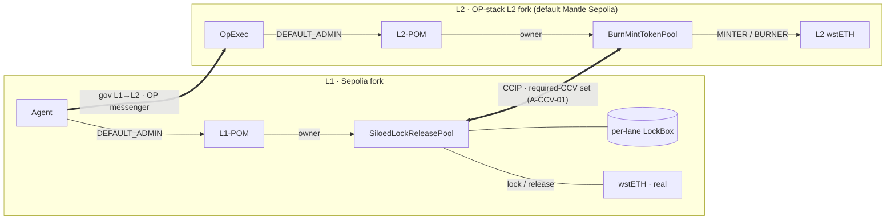

# wsteth-2.0

> **Current public deployment: September 15, 2026.** [Report and addresses](docs/deployment-2026-09-15.md) ·
> [Current POM permissions and operating instructions](docs/CURRENT-DEPLOYMENT.md).
> 431 live state checks and 28 fork tests passed. Explorer verification is 113/114 (SRLib outstanding).
> Live DON delivery was not tested. Older POM API discussions below are historical; the current guide supersedes them.

Dashboard moved to [multichain](https://github.com/lidofinance/multichain/blob/main/docs/index.html) ·
[publishing and local preview](https://github.com/lidofinance/multichain/blob/main/docs/PUBLISHING.md).

Disposable testnet bring-up **and verification** of **Lido core with Dual Governance** (L1) and
**wstETH bridged via CCIP 2.0** with the Lido additions (siloed L1 pool, dual-CCV quorum,
`PoolOperationManager`) to an L2. Targets **Sepolia + Mantle Sepolia** as local anvil forks; that
lane carries Chainlink's real CCIP 2.0 ramps and is where the dual-CCV quorum (A-CCV-01) is
exercised gating — see §4.

Status: **public deployment and handover complete; source verification incomplete (SRLib).** `just all` runs the deployment pipeline. *Which substrates
exist*, and what "throwaway" does and does not mean, is [§1.1](#11-substrates--the-canonical-status-claim)
— the one place that claim lives; every other document refers to it rather than restating it
(`A.6.B:6.1`, `CC-A.6.B.4`).

This README is structured with the First Principles Framework so that *what is built* stays
distinct from *what is claimed* and *what the evidence licenses*. The governing patterns are cited
inline: **`A.6.B`** (boundary norms, L/A/D/E), **`B.3`** (F–G–R assurance typing),
**`A.7`/`A.15`** (Role ≠ Method ≠ Work). `ARCHITECTURE.md` carries the topology and FPF structural
views; this README is the assurance-claim layer.

---

## 1. What this is (and is not)

- **It is** a one-command, throwaway rehearsal of the *full* topology: real Lido + Dual Governance
  on an L1 fork, the production L2 wstETH token + CCIP 2.0 siloed-pool stack on an L2 fork, the
  governance hand-over, and an **end-to-end bridge round-trip with a 2-of-2 CCV quorum** that
  actually mints/burns on the forks.
- **It is not** a claim about the live system. The off-chain transports do not exist on a fork
  (no OP sequencer, no Chainlink DON), and — the defining finding of this build — **ramp support is lane-specific.** The Sepolia–Mantle Sepolia scenarios exercised real forked CCIP 2.0 ramps; other pairs can differ. What that does and does not license is stated explicitly in §4.

### 1.1 Substrates — the canonical status claim

The following records carry deployments of this stack. This table is the **canonical location**
(`A.6.B:7`) of the "what is deployed where" claim; `LIVE_DEPLOY_CONCERNS.md`,
`draft-manual-test-plan.md`, `ARCHITECTURE.md` and `PERMISSIONS.md` cite it rather than restating it.

| Substrate | Record | Pair | State |
|---|---|---|---|
| **anvil forks** — the development substrate | `config/chains` (templates, filled in place at deploy time) | Sepolia ↔ Mantle Sepolia | re-created on demand; `just all` reproduces it. Archived runs under `deployments/forks/` |
| **live deploy #2** | `config/chains.live-mantle` | Sepolia ↔ Mantle Sepolia — the **real CCIP 2.0** lane | deployed **2026-06-12**; record committed; archived at `deployments/chains.live-mantle/sepolia-mantle_sepolia/2026-06-12_22-49/`. Collapsed governance (one key in all four fields); DG committees on anvil dev keys. This is the deployment `draft-manual-test-plan.md` exercises |
| **live deploy #3** | `config/chains.live-mantle-v3` | Sepolia ↔ Mantle Sepolia — the **real CCIP 2.0** lane | deployed **2026-08-30**; record at `config/chains.live-mantle-v3`; archived at `deployments/chains.live-mantle-v3/sepolia-mantle_sepolia/2026-08-31_00-02/`. Distinct `ACTORS_MNEMONIC` principals, predating the upstream POM UUPS revision, DG committees from `ACTORS_MNEMONIC[4..10]` (`docs/plan-v3-dg-committees.md`). Historical; superseded by the September 15 deployment |
| **Current public deployment** | `config/chains.live-mantle-2026-09-15` | Sepolia ↔ Mantle Sepolia | Deployed **2026-09-15**; 431 live checks, 28 fork tests; 113/114 explorer-verified, live DON delivery untested. [Report](docs/deployment-2026-09-15.md) |

**"Throwaway" said precisely.** It is a claim about the *governance identities and the L1 core*, not
about the substrate. The L1 Lido core + Dual Governance are deployed **fresh by this pipeline** on
every substrate; nothing here touches Lido mainnet or an official Lido testnet deployment, and every
role-holder is a disposable key — the governance principals are distinct addresses on the current
record but single EOAs derived from a throwaway `ACTORS_MNEMONIC`, not multisigs, and Dual
Governance's committees are the same kind of holder (`ACTORS_MNEMONIC[4..10]`,
`docs/plan-v3-dg-committees.md`). Live deploy #2 still seats those committees on
**publicly-known anvil dev keys**. The September 15 record is current; #2 and #3 are retained as historical records.

---

## 2. Architecture / topology (end state)

> Full contract catalog, actor catalog, and relationship matrices: [`ARCHITECTURE.md`](./docs/ARCHITECTURE.md)
> (governed by FPF `C.30` — a *description* of the end state, distinct from the `B.3` claims below).
> What the system is *for* — required effects, the bearers they are allocated to, and the ones with no
> bearer today: [`FUNCTION.md`](./docs/FUNCTION.md) (`A.6.F` / `C.30.ASV`). Who may do what:
> [`PERMISSIONS.md`](./docs/PERMISSIONS.md). What each deployed *value* means, and which ones are still
> an open decision: [`PARAMETERS.md`](./docs/PARAMETERS.md) (`A.6.RSIR` / `A.18` / `C.11`). Short answers
> to the recurring questions — what is pausable, who pauses and who resumes, what is upgradable, what
> is timelocked and what bypasses it: [`FAQ.md`](./docs/FAQ.md) (a reading view over the four above, `E.17`).
> The three pause flags on their own, with a role matrix and an actor matrix of every pause/unpause
> reachable directly or through the proposal queue: [`PAUSES.md`](./docs/PAUSES.md). Every lever in
> one table, one row each — the callable function, who can originate it, the role each of them uses,
> the contract, and the POM timelock it serves: [`LEVERS.md`](./docs/LEVERS.md) (the lever-first
> transpose of `PERMISSIONS.md` §2.1).

```
 L1  (Sepolia fork, :28002)                          L2  (Mantle Sepolia fork)
 ─────────────────────────────                       ──────────────────────────────────
 Voting → DualGovernance → Timelock                  OptimismBridgeExecutor (OpExec)
        → AdminExecutor → Agent ─┐                     · ethereumGovernanceExecutor = L1 Agent  (pinned)
                                 │                      · holds L2-POM DEFAULT_ADMIN_ROLE
   Lido wstETH (real ERC20)      │  gov L1→L2          · proxy admin + token DEFAULT_ADMIN_ROLE
        ▲ lock/release           │  (OP messenger)         of L2 wstETH
        │                        └───────────────▶    L2 wstETH = BurnMintERC20BridgedPermit (OssifiableProxy)
   SiloedLockReleaseTokenPool                              ▲ mint/burn (MINTER_ROLE/BURNER_ROLE)
        │  ├─ per-lane ERC20LockBox (siloed)               │
        │  └─ PausableAdvancedPoolHooks                BurnMintTokenPool
        │         owner = L1-POM ◀── DEFAULT_ADMIN = Agent   ├─ PausableAdvancedPoolHooks
        │                                                    └─ owner = L2-POM ◀── DEFAULT_ADMIN = OpExec
   TokenAdminRegistry: admin = L1-POM, pool bound    TokenAdminRegistry: admin = L2-POM, pool bound

        ╰────────  CCIP bridge · real Chainlink ramps (2.0 on real-2.0 lanes, else 1.5)  ─────────╯
                L1→L2: lock → mint     L2→L1: burn → lockbox release
                required-CCV set on the 2.0 path: gate `A-CCV-01` (§5)
```

*Rendered view:*



A single L1 DG proposal can reconfigure either side: `Voting → DG → Timelock → AdminExecutor →
Agent → (L1 directly | L1XDM → OpExec) → L1-POM / L2-POM → pool/hooks`. On a 2.0 lane, `OffRamp.execute` admits
the transfer only when **every CCV in the required set** has reported — the set our hooks declare
(**one** entry as deployed) unioned with the lane's mandated CCVs. That gate is `A-CCV-01` (§5); the
2-of-2 configuration exists only inside `RealCcvLane`.

Current public addresses live in `config/chains.live-mantle-2026-09-15/*.json` and its `state/` directory. `config/chains/` holds templates.

---

## 3. Two scoped assurance claims — `B.3`

"It's verified" is not one statement. Per `B.3` each claim is a typed `Assurance(H, C | K, S)` with
`S ∈ {design, run}`, and the two are **published separately and never fused into one score**
(`CC-B3.8`). Neither claim publishes an `Rᵢ` or an `R_eff`: nothing in this repository computes one,
and `CC-B3.11` does not let a quoted formula raise assurance on its own. What each claim does carry
is the set `CC-B3.11` requires before reliance — evidence ref, scope, evaluation condition,
limitation, **decay and reopen condition**.

| Field | **Claim A — deployment state is correct** | **Claim B — end-to-end behaviour** |
|---|---|---|
| `C` — the claim | the deployed ownership/role matrix, TAR registration, lane support, siloed lockbox and governance hand-over match the end-state matrix (`PERMISSIONS.md` §5) | our pool/hooks/lockbox wiring carries a transfer both ways over the **real forked ramps** and enforces every pool-borne gate |
| `S` | **design / state-grade** | **run-grade** |
| `K` — context | in-description; contracts read directly over whatever `RPC_*` point at, at the block the run sees | in-process forks (`vm.createFork`) of the real networks; a genuine `ccipSend` originates the send leg, the receive leg pranks the real OffRamp (a fork has no DON) |
| `F` — formality | **high** (F2–F3, proof-grade schema diff) | medium |
| `G` — scope | **the assertions in `config/state-mate/wsteth.yaml`, and nothing else.** Membership of *named addresses*, not set cardinality — the unpinned surface is enumerated in `PERMISSIONS.md` §2.2.4 and `PARAMETERS.md` §9, and `L-SEP-01` (§5) is the slice Claim A structurally cannot see | excludes the real Chainlink-DON commit/execute, Hyperlane attestation, OP 7-day finality, live fee/gas economics, and cross-decimal transfers — spelled out in §4 (`CC-B3.5`) |
| Evidence ref (`A.10`) | `run/state-mate.log` inside the archive `script/08_verify_state.sh` writes per run (`deployments/<type>/<pair>/<timestamp>/`), alongside `parameters.env` carrying `GIT_COMMIT`, `ARCHIVED_AT` and `STATE_MATE_RESULT`. state-mate's own summary line is `<N> checks passed` | `state/forge-scenarios.log`, written by `just test-scenarios` (header: date, commit, `L2_CHAIN`, `RECORD_DIR`). Step 08 copies it into `run/` of the archive when it is present — note the ordering caveat in the script |
| Size, September 15 run | **431 live state checks passed**; scoped to the archived wiring and selected record | **28 fork scenario tests passed, zero skips**, with `CCV_LANE_REQUIRED=1` |
| CL on the load-bearing edge | **high** — every edge is a contract we deployed and read back | **low (CL0–CL1)** — the pranked-OffRamp→real-DON edge; the `ccipSend` send leg is higher-CL |
| **Decay / reopen** (`CC-B3.6`, `CC-B3.11`) | a green run is valid only for the block it read. Reopens on: any edit to `config/state-mate/wsteth.yaml` or the deploy record it reads, any redeploy, and any `DEFAULT_ADMIN_ROLE` change to a timelock parameter (`PARAMETERS.md` §3 — the guardian can no longer make one) | reopens on a lane's ramp-version change (see `A-CCV-01`'s condition in §5) and on any change to the deploy record. **DON delivery is not provable from our side** — treat delivery as *expected, pending Chainlink*, never as a hard gate (`draft-manual-test-plan.md` §5) |
| Licenses | the *topology* matches intent, **within `G`** | the wiring carries a transfer and enforces the pool-borne gates on the real ramps — **not** that the live DON will |

> Both numbers above are properties of committed files (the yaml's assertion list; the `test_*`
> function count), not quotations from an undated run. The run logs are the `A.10` carriers; quote
> the log, not this table, when a figure has to be relied on.

---

## 4. The CCIP 1.5-vs-2.0 finding — what the gating Claim B licenses

The forks carry **`Router 1.2.0` + `EVM2EVMOnRamp/OffRamp 1.5.0`** —
the CCV-aware 2.0 `OffRamp.execute` path is beta and **not deployed there.** Correcting an earlier
assumption: our pools/hooks **are** drivable by the 1.5 ramps — `TokenPool is IPoolV1V2`, so a 1.5 ramp
calls the pool's legacy V1 `lockOrBurn`/`releaseOrMint` directly. Exactly one thing is missing on the
1.5 path, and it is three separately governed things, not one "capability" (`A.6.F` `CC-A6F-2/4`, the
repair `FUNCTION.md` §0 makes):

- the **required effect** is `FUNCTION.md` `RB-05` — *inbound value is admitted only when the required
  independent verifiers have reported*;
- the **gate** that would admit it is `A-CCV-01` (§5);
- the **bearer** is `FUNCTION.md` `FE-06`'s enforcing half, which lives in an **OffRamp 2.0**. On a
  1.5-only lane that bearer is **absent**, so `RB-05` is requirement-only there and `A-CCV-01` is
  **relaxed to optional** (`FUNCTION.md` `G-01`).

Our side's half — `FE-05`, *declaring* the verifier set — is deployed and unaffected; nothing on our
side can make a 1.5 OffRamp read it.

> **Update (2026-06-12):** Chainlink HAS shipped 2.0 to the **sepolia ↔ mantle_sepolia** lane —
> `OnRamp 2.0.0` is the router's *active* onramp both directions and an `OffRamp 2.0.0` is registered
> alongside the legacy 1.5/1.6 ones (the lane's default CCV is Chainlink's own
> `VersionedVerifierResolver 2.0.0`). On such pairs A-CCV-01 is exercised **gating** by
> `RealCcvLane.t.sol` against the REAL ramps; it remains relaxed/optional on any 1.5-only pair.

Accordingly there are three behaviour harnesses:

- **Gating — `test/scenario/RealLaneBridge.t.sol`** (`just test-scenarios`): drives our 2.0 pools with
  the **real, forked 1.5 ramps** (resolved from the 1.2.0 Router via TAR). A genuine `ccipSend`
  originates the send leg; the receive leg pranks the real 1.5 OffRamp → V1 `releaseOrMint` (a fork has
  no live DON). Asserts the live-path capabilities: A-RL-01 (both directions), pause, RMN curse,
  caller-auth, siloed custody, conservation.
- **Gating on 2.0 lanes — `test/scenario/RealCcvLane.t.sol`** (`just test-scenarios`, self-skips on
  1.5-only pairs): governance enables CCV **2-of-2** via the production path (`L1-POM.directCall →
  hooks.applyCCVConfigUpdates`, CCVs = our deployed `VersionedVerifierResolver→DummyMessageIdVerifier`
  + a second CCV), a genuine `ccipSend` originates through the **real OnRamp 2.0**, and the **real
  OffRamp 2.0's** permissionless `execute` enforces the quorum (2-of-2 mints; 1-of-2 ⇒ FAILURE, no
  mint). No self-owned ramps, no router-owner impersonation. Test-side stand-ins: the second CCV is a
  `MockCCV` (a second verifier operator), and the test calls `execute` itself (no live DON/executor on
  a fork) supplying each CCV's proof — the deployed Dummy verifier's proof is genuinely checked.
- **Optional — `test/scenario/CcvBridge.t.sol`** (`just test-ccv`): deploys a self-owned
  `OnRamp 2.0`/`OffRamp 2.0` + 2-of-2 mock-CCV quorum on the fork (owner impersonation, test-side) and
  relays the round-trip. Validates **A-CCV-01** and the §3 self-owned/self-relayed 2.0 stack
  alternative (`LIVE_DEPLOY_CONCERNS.md` §3).

**Declared G-narrowing (`CC-B3.5`).** The gating Claim B's `ClaimScope` *excludes*: the real
Chainlink-DON commit/execute (a fork has no DON — the receive leg is a documented prank stand-in),
Hyperlane attestation, OP 7-day finality, live fee/gas economics, and — relaxed here — the **2.0 CCV
quorum** (no live 2.0 lane to enforce it; validated only by the optional `CcvBridge` harness). The
send leg, by contrast, is a *genuine* `ccipSend` on the real 1.5 lane (origination is on-chain, needs
no DON). This is stated, not silently assumed. Also outside the behavioural scope: cross-decimal
transfers and dust — both legs are 18-decimal wstETH, so `_parseRemoteDecimals`'s non-18 fallback is
not exercised (re-confirm against the live OffRamp's `CCIP_POOL_V1_RET_BYTES = 32` cap,
`LIVE_DEPLOY_CONCERNS.md` §5.4).

---

## 5. Claim Register — boundary norms `A.6.B` (L/A/D/E)

The load-bearing phrases are atomized (`CC-A.6.B.1`) and routed to one quadrant each
(`CC-A.6.B.2`). Per `A.6.B:7` the register carries the **Statement as authored** (not a paraphrase)
and a **Canonical location** — the one place the statement lives, so every other document cites the
ID instead of writing its own account of it (`A.6.B:6.1`, `CC-A.6.B.4`). Without that column the set
drifted: four documents once carried four different mechanisms for `A-CCV-01`'s quorum.

**References run in the admitted directions only** (`A.6.B:6.4`, §8.4.1 Step 4): `D → {L, A, E}`,
`E → {A, L}`, `A → L`. Nothing points upward — in particular the gate and law rows do **not** name
the tests that adjudicate them; the `E-*` rows carry the adjudication. "CCV-approved" is **not one
claim** — it is a gate, a duty, and evidence, each separately checkable.

| ID | Quadrant | Statement (as authored) | Canonical location | References |
|---|---|---|---|---|
| **L-SILO-01** | Law / Def | "a *siloed* lane ≝ a dedicated `ERC20LockBox` per remote chain; release draws only from that box" | `ARCHITECTURE.md` §5.2 | — |
| **L-SEP-01** | Law / Def | "the three governance principals — `chainlink_mcms`, the Emergency Multisig (`emergency_brakes`), and `deployer` — are pairwise distinct addresses" | `PERMISSIONS.md` §4.3 | — · **Obtains on `config/chains/*` and `config/chains.live-mantle-v3/*`; does not obtain on `config/chains.live-mantle/*` (v2).** The config `.guardian` field is legacy and unused by current `1_Deploy`. Live deploy #2 still resolves all four record fields to `0xE528…0597`. **Claim A still cannot detect a violation**: `hasRole(ROLE, *alias)` is satisfied by one key wearing every alias, and no pairwise-distinctness assertion exists (`PERMISSIONS.md` §2.2.4, `FPF-REVIEW.md` R-06) |
| **A-CCV-01** | Admissibility (gate) | "`OffRamp 2.0.execute` admits a token transfer **iff** every CCV in the *required set* has reported. For a token-only transfer that set is the union of the CCVs the pool declares — our `AdvancedPoolHooks.getRequiredCCVs`, i.e. `getCCVConfig`'s directional set plus the threshold set when `getThresholdAmount() ≠ 0` and the amount reaches it — and the lane's `laneMandatedCCVs` on the OffRamp. The OffRamp's `defaultCCVs` enter only when some entry is `address(0)`, which a non-empty pool declaration prevents" | here | → `L-SILO-01` (none) · **Deployed coordinate:** our hooks declare **one** CCV per direction (the `VersionedVerifierResolver`) with empty threshold sets — `PARAMETERS.md` `P-CCV-01`/`P-CCV-02`/`P-CCV-03`. **A 2-of-2 quorum is deployed nowhere:** it exists only inside `RealCcvLane`, created by a governance reconfiguration that adds a test-local `MockCCV` as the second member. The resolver does **not** fan out — it maps a version tag to one verifier. **Reopen/decay:** the gate is borne only while the lane's active OnRamp *and* registered OffRamp are 2.0.0 with a matching `execute` ABI; set `CCV_LANE_REQUIRED=1` so a regression to 1.5-only fails the run loudly instead of self-skipping |
| **A-RL-01** | Admissibility (gate) | "a transfer is admissible iff the per-lane token bucket for its direction is not exceeded" | `ARCHITECTURE.md` §5.3 | → deployed coordinates and their open status: `PARAMETERS.md` `P-RL-01–05` (outbound cap 500e18, inbound 330e18, each refilling over ~24 h — testnet placeholders with no stated comparison basis) |
| **A-POM-01** | Admissibility (gate) | "`L1-POM` / `L2-POM` gates pool/hook admin actions and `directCall` is the admin path; `transferOwnership` and POM `upgradeToAndCall` are `Blocked` on both chains, while `unpauseCrossChainTransfers()` is `Blocked` on the L1 hub only — on a non-L1 spoke MCMS may queue `hooks.unpauseCrossChainTransfers()` at 3 d; six selectors carry a 14-day delay override — `transferAdminRole`, `setPool`, `setDynamicConfig` on the pool and on the CCV verifier, `updateAdvancedPoolHooks`, `configureLockBoxes`; only the POM `DEFAULT_ADMIN_ROLE` may tune the timelock or authorize a UUPS upgrade; Emergency voids a bad MCMS queue with `haltProposalQueue()` (epoch++)" | `ARCHITECTURE.md` §5.3 | → deployed coordinates: `PARAMETERS.md` `P-POM-01–09`. The override set comes from **our** `config/default_config.json`, injected via `DEFAULT_CONFIG` (`script/_common.sh`). `lib/ccip` is pinned to `lido-proposals`, which already binds the real `transferAdminRole` and `setPool` at 14 d; we still inject because we Block hooks `unpauseCrossChainTransfers()`, Block the target-blind UUPS selector, and add the CCV `setDynamicConfig` overload. `PARAMETERS.md` §0.2 / `P-POM-05`. Claim A pins `UPGRADE_INTERFACE_VERSION = 5.0.0` and the Blocked selector; `RealPomUpgrade` rehearses the state-preserving admin upgrade on both forks |
| **D-GOV-01** | Deontic (subj = Agent) | "the Agent SHALL hold `L1-POM` admin directly / reach `L2-POM` via OpExec, and set the required CCVs" | `PERMISSIONS.md` §2.2.1 (`D-ACT-01`) | → `A-CCV-01`, `A-POM-01` (the gates it must keep) · → `E-STATE-01`, `E-CCV-01` (what adjudicates it) |
| **E-CCV-01** | Evidence | "carriers for the quorum gate: `CCIPMessageSent`, the CCV reports, the `OffRamp.execute` receipt, and the mint / lockbox deltas" | here | → `A-CCV-01`. **Adjudicated by:** gating on real-2.0 pairs — `RealCcvLane.test_ccv_quorum_1of2_does_not_mint_on_real_offramp` (real OffRamp 2.0; 1-of-2 ⇒ FAILURE, no mint); optional on 1.5-only pairs — `CcvBridge.test_quorum_1of2_does_not_mint`, a **self-owned-ramp harness under owner impersonation**, a different `K` and a lower grade |
| **E-STATE-01** | Evidence | "state-mate diff carrier: on-chain state vs. the expected wiring; check count is read from the archived run, not frozen in prose" | `config/state-mate/wsteth.yaml` | → `A-RL-01` (both buckets, both lanes), `A-POM-01` (mode, delays, UUPS interface, the Blocked selectors **per chain** — `0xf2fde38b` and `0x4f1ef286` on both, `0x3f4ba83a` on L1 only — all six overrides, CCV `0x869b7f62` at 14 d, and `0xad0f7c64` at the global), `L-SILO-01` (lockbox owner + authorized callers) · **not** `L-SEP-01`, which nothing asserts · step 08 §4b resolves the implementation slot and checks its `proxiableUUID` · run carrier: §3 |

> **Which harness evidences `A-RL-01`.** The gating carriers are `RealLaneBridge`'s
> `test_outbound_over_cap_reverts` / `test_inbound_over_cap_reverts` / `test_outbound_bucket_refills_at_configured_rate`
> (real forked ramps). `CcvBridge`'s `test_over_cap_rate_limit_reverts` /
> `test_over_cap_inbound_rate_limit_does_not_mint` exercise the same gate on the **non-gating**
> self-owned-ramp harness — a different `K` and a lower assurance grade (`CC-B3.1`). Both are real;
> they are not interchangeable, and only this register lists both.

---

## 6. Role / Method / Work hygiene — `A.7` / `A.15`

Carriers do not act, and a passing script is not an occurrence (`CC-A7.3`, `CC-A7.4`):

- **Epistemes / carriers** (do not act): `state/*.json`, `config/chains/*.json`, the
  state-mate config. A *system bearing TransformerRole* (the deployer EOA, or an impersonated
  account) enacts the **Work** that reads/writes them.
- **MethodDescription ≠ Work.** A green `forge test` is a method-level check; the dated **Work** is
  a broadcast against a named fork with its receipts. Claim A is method/state-grade; Claim B's
  carriers are the on-fork execution deltas.
- **The relayer and CCVs, said precisely.** The relayer is a *system bearing TransformerRole* that
  enacts `OffRamp.execute` Work; each mock CCV is a system that *produces an attestation carrier*;
  the OffRamp's acceptance is the gate `A-CCV-01`. We never say "the CCV approves" as if a document
  acts.

---

## 7. Pipeline

Each step is idempotent on its own outputs; `just all` runs the lot.

| # | Step | Tool | `just` recipe |
|---|---|---|---|
| 00 | forks reachable (L1 11155111 / L2 11155420) | bash | `forks-check` |
| 01 | L1 Lido core + Dual Governance | core hardhat (sibling) | `l1-core-dg` |
| 02 | L2 `OptimismBridgeExecutor` (pinned to L1 Agent) | forge | `l2-gov` |
| 03 | L2 wstETH (`BurnMintERC20BridgedPermit` + `OssifiableProxy`) | forge | `l2-token` |
| 04 | CCIP deploy (siloed L1 pool / BurnMint L2 pool + hooks/CCV + both POMs) | ccip `1_Deploy` | `ccip-deploy` |
| 05 | CCIP configure (lanes, rate limits, lockbox, ownership → `L1-POM` / `L2-POM`) | ccip `2_Configure` | `ccip-configure` |
| 07 | set pool in TAR; `L1-POM` admin → Agent, `L2-POM` admin → OpExec; L2 token end-state | bash + ccip `3_SetPoolAndTransferOwnership` | `set-pool-gov` |
| 08 | **Claim A** — state diff vs the §2 matrix | state-mate | `verify-state` |
| 06+09 | **Claim B** — dual CCV + relayer + scenarios | forge multi-fork test | `test-scenarios` |
| 10 | Etherscan/Blockscout source verification (live only; self-skips on anvil forks) | bash | `verify-contracts` |

> Step 06 (2nd mock CCV + 2-of-2 quorum + L1↔L2 relayer) is realized *inside* the forge multi-fork
> test (`test/scenario/CcvBridge.t.sol`), not as a standalone on-chain script — see §4 for why.

---

## 8. Quick start

```sh
just init                 # fetch lidofinance submodules (lido-l2-with-steth, governance-crosschain-bridges)
just init-thirdparty      # GATED: forge-std + ccip submodule + its @chainlink/OZ npm deps
just forks-check          # assert the L1 + L2 forks are reachable with the expected chain ids
just all                  # full pipeline: deploy → configure → handover → verify (A) → scenarios (B)
```

Forks are served by the sibling `../forks` macOS tray app (`RPC_SEPOLIA`, `RPC_<L2 SLUG>`). The L2
of the pair is selected by `L2_CHAIN` (default `mantle_sepolia`, with `RPC_MANTLE_SEPOLIA`) —
slugs name `config/chains/<slug>.json`.
The deployer is anvil dev key #0 (in `.env`). Claim A uses the lidofinance `state-mate` tool
vendored as the `lib/state-mate` submodule (`just init-thirdparty` installs its yarn deps).

### Verify only — post-deploy, fork the deployed leaf

Both claims run *after* a deploy, against a **fork of the network the deployment lives on**, and are
re-runnable independently of the deploy:

```sh
just verify-state     # Claim A: state-mate ownership/role diff (E-STATE-01; 73 assertions, same on every pair)
just test-scenarios   # Claim B: forge — 17 gating tests on 1.5-only pairs, 20 on real-2.0 pairs (RealCcvLane's 3 vm.skip elsewhere)
just test-leaf        # both, in sequence
```

They are **substrate-agnostic** — driven only by the deploy record + the `RPC_*` endpoints, with no
hardcoded addresses and no anvil-only cheatcodes at verify time:

- **State testing** uses state-mate's full-delegation split (branch `feat/separate-deployed`),
  three files: the committed `config/state-mate/wsteth.yaml` holds only the **wiring**
  (relationships, `*aliases`) and no values; `config/state-mate/wsteth.inputs.yaml` holds the
  authored **inputs** (`config:` the role-holders on both POMs; `externals:` the Chainlink-owned
  CCIP infra — router + TokenAdminRegistry per chain — and the CCIP selectors, via `--inputs`); and step 08 generates the **address book**
  `config/state-mate/wsteth.deployed.yaml` (the **outputs**) from the deploy record (`$RECORD_DIR`,
  default `config/chains/*.json`) and passes it via `--deployed`. The split is by **provenance**:
  the address book holds *only what this repo deployed* (steps 01–04, plus the run's signer EOA),
  so anything we merely reference is an authored `externals:` fact. The inputs mirror `config/chains/*.json` (the deploy
  source); step 08 asserts the two agree before diffing, failing loudly on drift. ABIs are name-keyed in
  `config/state-mate/abis.json` (address-independent, survive redeploys). It reads on-chain state
  over whatever `RPC_*` point at, and **tees its output into the run archive** as
  `run/state-mate.log` — that file, not a number in prose, is Claim A's `A.10` carrier (§3).
- **Integration testing** forks each network in-process via `vm.createFork(RPC_*)`, reads the same
  record (`$RECORD_DIR`), and keeps all its mutations in-memory — so forking a **live** chain
  is read-only-safe.

So the same two commands run against **either** substrate, just by pointing `RPC_*` at it:

```sh
# persistent anvil fork (default): RPC_* -> the ../forks tray app, record = config/chains
just test-leaf

# live testnet fork (needs ARCHIVE RPCs carrying the deployment; keep its record separately):
RECORD_DIR=config/chains.live-mantle \
  RPC_SEPOLIA=<archive> RPC_<L2 SLUG>=<archive> just test-leaf
```

> An alternate record dir must live **under `config/`** (e.g. `config/chains.live-mantle`) — foundry's
> `fs_permissions` only grants the scenario test read access to `./config` and `./state`.

A preflight in each path asserts the record's contracts actually exist on the target RPC, so a
run-before-deploy or an RPC↔record mismatch fails loudly ("run the deploy first / check RPC+record")
instead of as a deep revert.

---

## 9. Dependencies

| Repo | Owner | Use |
|---|---|---|
| `lib/core` (`feat/scratch-dg`) | lidofinance | L1 Lido + DG scratch deploy (hardhat submodule, driven) |
| `lib/governance-crosschain-bridges` | lidofinance | `OptimismBridgeExecutor` (L2 gov) |
| `lib/lido-l2-with-steth` (`feat/token-upgrade`) | lidofinance | `ERC20BridgedPermit` + `OssifiableProxy` base for L2 wstETH (no patch — the branch itself drops the legacy `bridge` mint/burn authority) |
| `lib/ccip` (`lido-proposals`) | smartcontractkit | CCIP 2.0 pools/hooks/CCV/`PoolOperationManager` + `1/2/3` deploy scripts (vendored, driven) |
| `lib/forge-std` | foundry-rs | scripting |
| `lib/state-mate` | lidofinance | Claim A on-chain state diff (vendored submodule, yarn tool) |

Non-lidofinance installs are **gated** behind `just init-thirdparty` (run only with approval).
The OZ version split is by Foundry profile (default → 5.3 for CCIP/our code; `FOUNDRY_PROFILE=token`
→ 4.x for the 0.8.10 L2 token). Build mechanics, gotchas, and the corrected CCIP-version reasoning
are in `ARCHITECTURE.md` §6 and the project memory.
